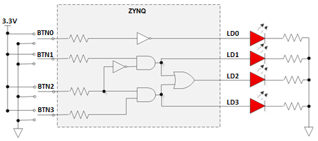

# Vivado FPGA Design Flow on Zynq
This workshop provides participants the necessary skills to develop digital design in Xilinx FPGA fabric and become familiar with synthesis, implementation, I/O planning, simulation, static timing analysis and debug features of Vivado.

The labs have been developed on a PC running Microsoft Windows 10 professional edition and using **Vivado 2018.2** version tools.These labs can also be run using WebPack edition.

## Source Files Setup


To use the source files for each of the labs in this workshop, you either have to clone this repository or download in a zip format from Github. You can clone the repository using  the following command:

  ```
  git clone https://github.com/xupgit/FPGA-Design-Flow-using-Vivado.git
  ```

In the instructions for the labs;

**{sources}** refers to the location where you will get the base files for the labs [here](https://github.com/xupgit/FPGA-Design-Flow-using-Vivado/tree/master/source)

**{labs}** refers to the location which you will use as your workspace for the labs in the workshop

**{boards}** refers to the target board. Currently PYNQ-Z1 and PYNQ-Z2 are the supported target boards

---
**NOTE**

Board support for the PYNQ-Z1 and PYNQ-Z2 are not included in Vivado 2018.2 by default. The relevant files, included in this repository, need to be copied to:

 {Vivado installation}\data\boards\board_files


---

## Hardware Setup

**PYNQ-Z2**:  Connect the board to the PC using a micro USB cable. Make sure that a jumper is connected to JTAG (between JP1\_1 and JP1\_2) to use the board in the development mode.  Also, make sure that another jumper is placed between J9\_2 and J9\_3 to select USB as a power source.


**PYNQ-Z1**:  Connect the board to the PC using a micro USB cable. Make sure that a jumper is connected to JTAG (between JP4\_1 and JP4\_2) to use the board in the development mode.  Also, make sure that another jumper is placed between JP5\_2 and JP5\_3 to select USB as a power source.

## Labs Overview:

### Lab 1
This lab guides you through the process of using Vivado IDE to create a simple HDL design.  You will simulate, synthesize, and implement the design with default settings.  Finally, you will generate the bitstream and download it into the hardware to verify the design functionality.

<p align="center">

</p>

### Lab 2
This lab shows you the synthesis process and effect of synthesis settings changes.  You will analyze the design and the generated reports.

<p align="center">

</p>

### Lab 3
This lab continues with the previous lab. You will perform static timing analysis. You will implement the design with the default settings and generate a bitstream.  Then you will open a hardware session and program the FPGA. Finally the design will be validated by programming the hardware in SDK using the provided software application running on A9.

### Lab 4
In this lab you will use Vivado IP Catalog to generate a clock resource. You will instantiate the generated clock core in the provided waveform generator design. You will also use IP Integrator to generate a FIFO core and then use it in the HDL design.

<p align="center">

</p>

### Lab 5
In this lab you will use the uart_led design that was introduced in the previous labs. You will start the project with I/O Planning type, enter pin locations, and export it to the rtl. You will then create the timing constraints and perform the timing analysis.

### Lab 6
In this lab you will use the uart_led design that was introduced in the previous labs. You will use Mark Debug feature and also the available Integrated Logic Analyzer (ILA) core available in Vivado IP Catalog to debug the hardware.
