# Vivado Design Flow

## Objectives 

After completing this lab, you will be able to:

- Create a Vivado project sourcing HDL model(s) and targeting the ZYNQ device located on the PYNQ-Z1 or PYNQ-Z2 (PYNQ-Z1 and PYNQ-Z2 use the same ZYNQ device)

- Use the provided Xilinx Design Constraint (XDC) file to constrain the pin locations
- Simulate the design using the Vivado simulator
- Synthesize and implement the design 
- Generate the bitstream
- Configure ZYNQ using the generated bitstream and verify the functionality

## Steps

### Create a Vivado Project using IDE                                                   

#### Launch Vivado and create an empty project targeting the PYNQ-Z1 or PYNQ-Z2 board, selecting Verilog as a target language. Use the provided lab1.v and lab1\_zynq.xdc files from the *2018\_2\_zynq\_sources\lab1* directory.

1. Open Vivado by selecting **Start > Xilinx Design Tools > Vivado 2018.2**
2. Click **Create New Project** to start the wizard. You will see *Create A New Vivado Project* dialog box. Click **Next**.
3. Click the Browse button of the *Project location* field of the **New Project** form, browse to **C:\xup\fpga\_flow\2018\_2\_zynq\_labs**, and click **Select**.
4. Enter **lab1** in the *Project name* field.  Make sure that the *Create Project Subdirectory* box is checked.  Click **Next**.

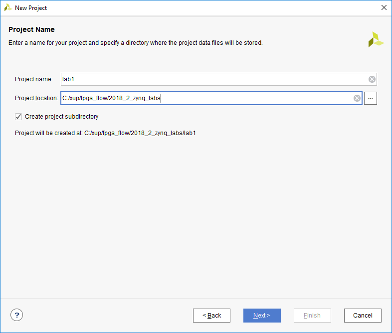

<i>Project Name and Location entry</i>

5. Select **RTL Project** option in the *Project Type* form, and click **Next**.

6. Using the drop-down buttons, select **Verilog** as the *Target Language* and *Simulator Language* in the *Add Sources* form.

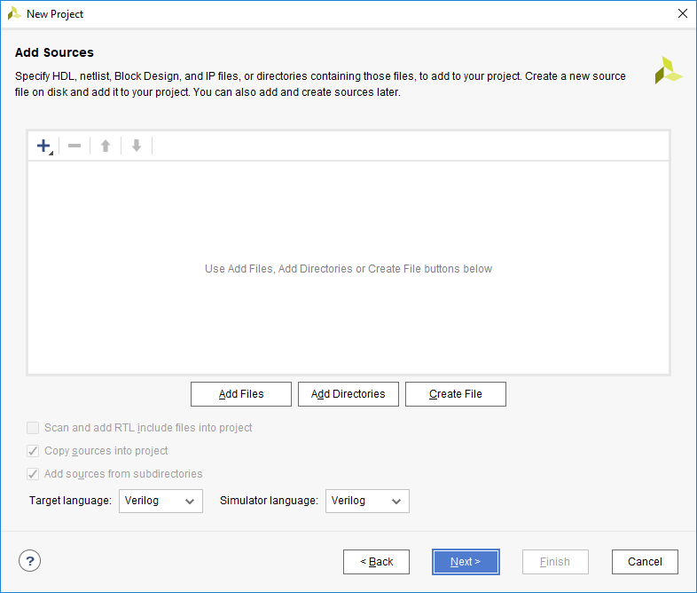

<i>Selecting Target and Simulator language</i>

	

7. Click on the **Blue Plus** button, then **Add Files…** and browse to the **C:\xup\fpga\_flow\2018\_2\_zynq\_sources\lab1** directory, select *lab1.v,* click **OK**.

   

   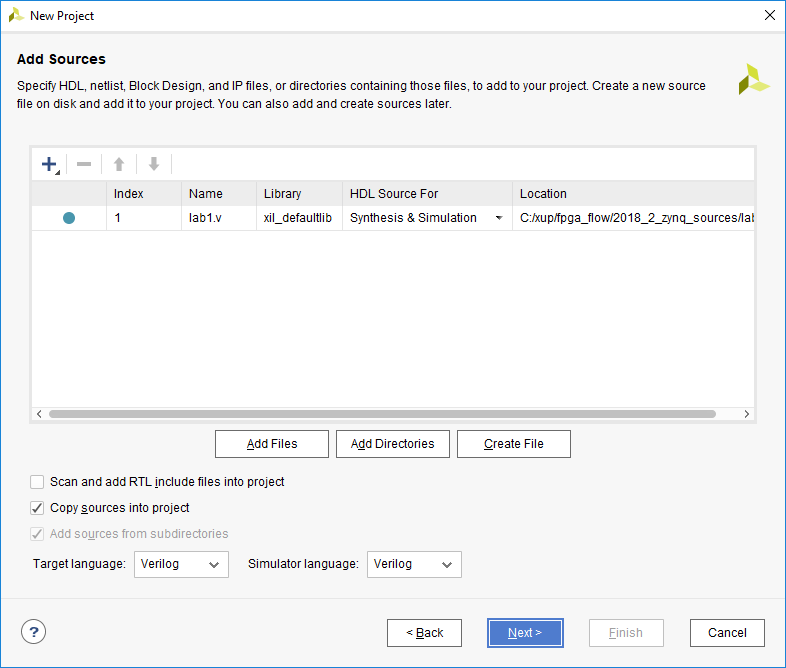
   

   

   

   If it is not already checked, check **Copy sources into project**

8. Click **Next** to get to the *Add Constraints* form.

9. Click on the **Blue Plus** button, then **Add Files…** and browse to the **C:\xup\fpga\_flow\2018\_2\_zynq\_sources\lab1** directory (if necessary), select *lab1\_zynq.xdc* and click **OK** (if necessary), and then click **Next.**

   The Xilinx Design Constraints file assigns the physical IO locations on FPGA to the switches and LEDs located on the board.  This information can be obtained either through the board’s schematic or the board’s user guide. 

10. In the *Default Part* form, use the **Parts** option and various drop-down fields of the **Filter** section. Select the **XC7Z020clg400-1**. ​		

    

    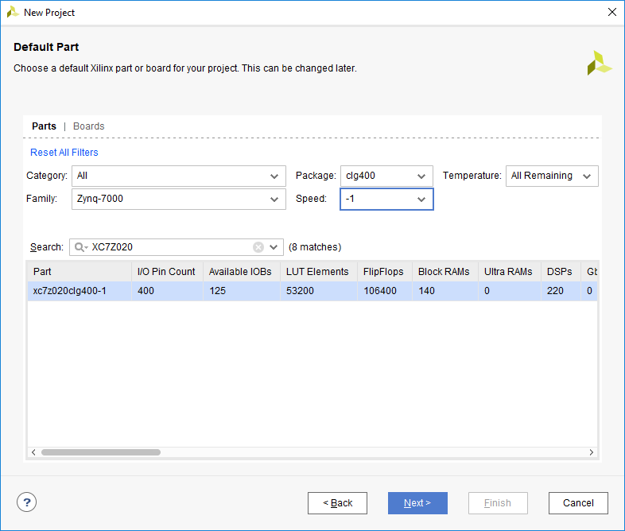
    

    

    <i>Part Selection for the PYNQ</i>
    

    You may also select the **Boards** option, select www.digilentinc.com for the PYNQ-Z1 board, tul.com.tw for the PYNQ-Z2 board under the Vendor filter and select the appropriate board. Notice that PYNQ-Z1 and PYNQ-Z1 may not be listed as they are not in the tools database. If not listed then you can download the board files for the desired boards either from Digilent PYNQ-Z1 webpage or TUL PYNQ-Z2 webpage. Click **Next**.

11.  Click **Finish** to create the Vivado project.  

Use the Windows Explorer and look at the **C:\xup\fpga\_flow\2018\_2\_zynq\_labs\lab1** directory.  You will find that the lab1.cache and lab1.srcs directories and the lab1.xpr (Vivado) project file have been created. The lab1.cache directory is a place holder for the Vivado program database. Two directories, constrs\_1 and sources\_1, are created under the lab1.srcs directory; deep down under them, the copied lab1\_<board>.xdc (constraint) and lab1.v (source) files respectively are placed.

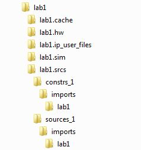

<i>Generated directory structure</i>

#### Open the lab1.v source and analyze the content.

1. In the *Sources* pane, double-click the **lab1.v** entry to open the file in text mode.

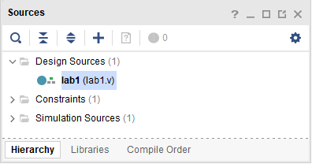

<i>Opening the source file</i>

2. Notice in the Verilog code that the first line defines the timescale directive for the simulator. Lines 2-4 are comment lines describing the module name and the purpose of the module.

3. Line 7 defines the beginning (marked with keyword **module**) and Line 17 defines the end of the module (marked with keyword **endmodule**).

4. Lines 8-9 defines the input and output ports whereas lines 12-15 defines the actual functionality.

#### Open the lab1\_zynq.xdc source and analyze the content.

1. In the *Sources* pane, expand the *Constraints* folder and double-click the **lab1\_zynq.xdc** entry to open the file in text mode. 

   

   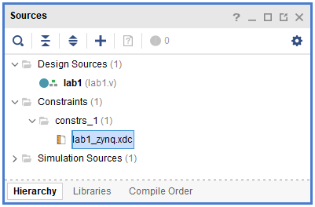
   

   

   <i>Opening the constraint file</i>
   

2.  Lines 5-8 define the pin locations for the input buttons and lines 13-16 define pin locations for output LEDs.

### Perform RTL analysis on the source file.

Expand the *Open Elaborated Design* entry under the *RTL Analysis* tasks of the *Flow Navigator* pane and click on **Schematic**.

The model (design) will be elaborated and a logic view of the design is displayed.

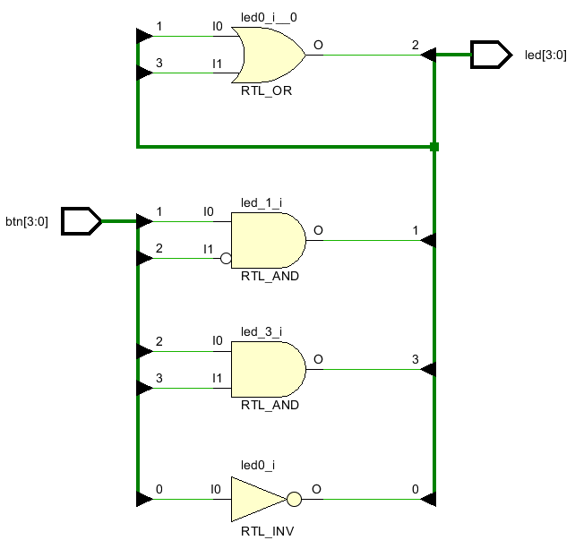

<i>A logic view of the design</i>

### Simulate the Design using the Vivado Simulator

#### Add the lab1\_tb.v testbench file.

1. Click **Add Sources** under the *Project Manager* tasks of the *Flow Navigator* pane.

   

   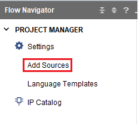
   

   

   <i>Add Sources</i>
   

2. Select the *Add or Create Simulation Sources* option and click **Next**.

   

   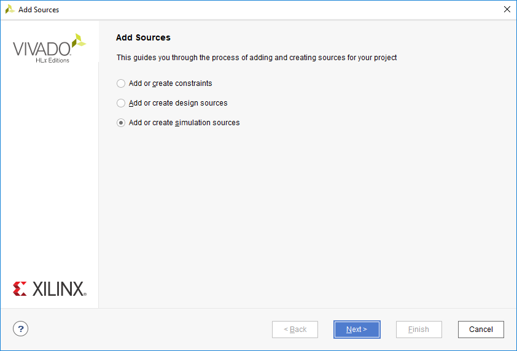
   

   

   <i>Selecting Simulation Sources option</i>
   

3. In the *Add Sources Files* form, click the **Blue Plus** button and then **Add Files…**.

4. Browse to the **C:\xup\fpga\_flow\2018\_2\_zynq\_sources\lab1** folder and select *lab1\_tb.v* and click **OK**.

5. Click **Finish**.

6. Select the *Sources* tab and expand the *Simulation Sources* group.

   The lab1\_tb.v file is added under the *Simulation Sources* group, and **lab1.v** is automatically placed in its hierarchy as a dut (device under test) instance.

   

   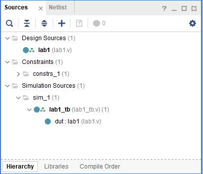
   

   

   <i>Simulation Sources hierarchy</i>
   

7. Using the Windows Explorer, verify that the **sim\_1** directory is created at the same level as constrs\_1 and sources\_1 directories under the lab1.srcs directory, and that a copy of lab1\_tb.v is placed under **lab1.srcs > sim\_1 > imports > lab1**. 

8. Double-click on the **lab1\_tb** in the *Sources* pane to view its contents.

   

   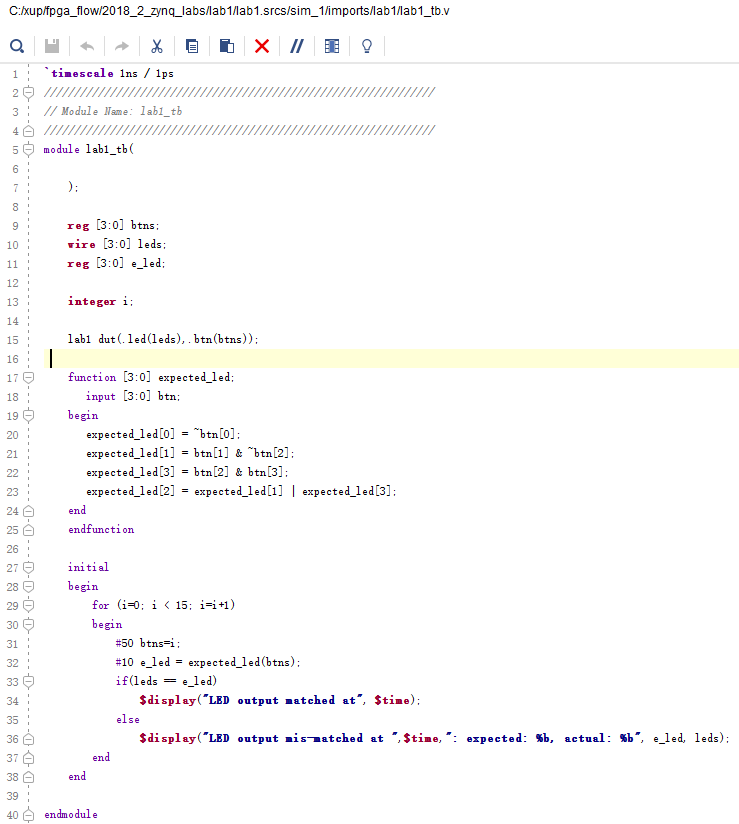
   

   

   <i>The self-checking test bench</i>
   

   The test bench defines the simulation step size and the resolution in line 1. The test bench module definition begins on line 5.  Line 15 instantiates the DUT (device/module under test). Lines 17 through 25 define the same module functionality for the expected value computation.  Lines 27 through 38 define the stimuli generation, and compare the expected output with what the DUT provides.  Line 40 ends the test bench.  The **$display** task will print the message in the simulator console window when the simulation is run.

#### Simulate the design for 200 ns using the Vivado simulator.

1. Select **Settings** under the *Project Manager* tasks of the *Flow Navigator* pane.

   A **Settings** form will appear showing the **Simulation** properties form.

2. Select the **Simulation** tab, and set the **Simulation Run Time** value to 200 ns and click **OK**.

   

   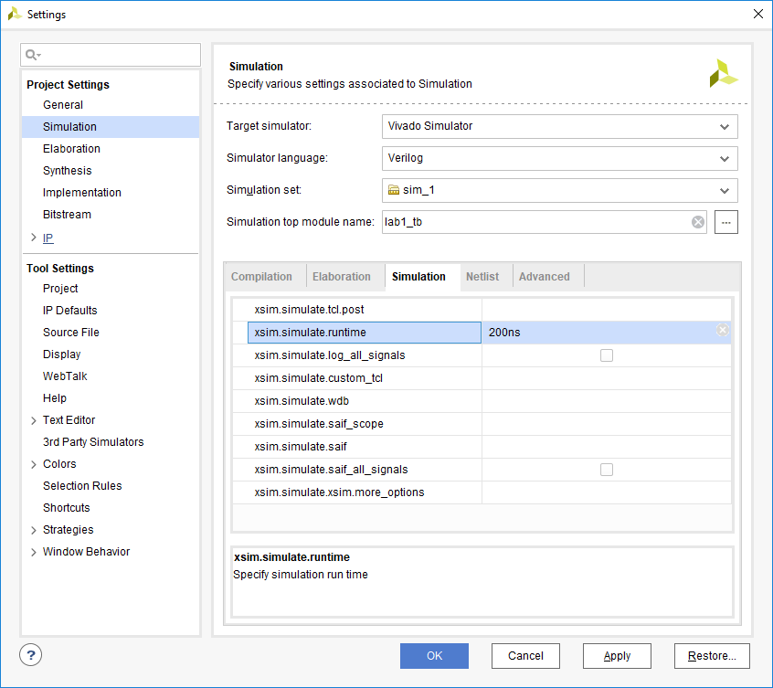
   

   

   <i>Setting simulation run time</i>
   

3. Click on **Simulation > Run Simulation > Run Behavioral Simulation** under the *Project Manager* tasks of the *Flow Navigator* pane.

   The testbench and source files will be compiled and the Vivado simulator will be run (assuming no errors). You will see a simulator output like the one shown below.

   

   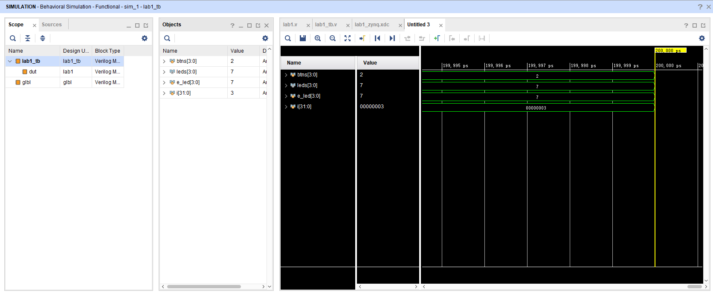
   

   

   <i>Simulator output</i>
   

   You will see four main views: (i) *Scopes,* where the testbench hierarchy as well as glbl instances are displayed, (ii) *Objects,* where top-level signals are displayed, (iii) the waveform window, and (iv) *Tcl Console* where the simulation activities are displayed.  Notice that since the testbench used is self-checking, the results are displayed as the simulation is run.

   Notice that the **lab1.sim** directory is created under the **lab1** directory, along with several lower-level directories. 

   

   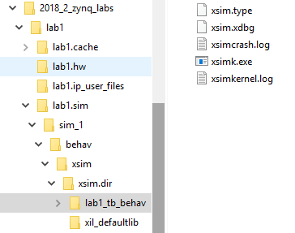
   

   

   <i>Directory structure after running behavioral simulation</i>
   

   You will see several buttons next to the waveform window which can be used for the specific purpose as listed in the table below.

<i>Various buttons available to view the waveform</i>

4. Click on the *Zoom Fit* button () to see the entire waveform.

   Notice that the output changes when the input changes.

   You can also float the simulation waveform window by clicking on the Float button () on the upper right hand side of the view. This will allow you to have a wider window to view the simulation waveforms. To reintegrate the floating window back into the GUI, simply click on the Dock Window button ().

#### Change display format if desired.

Select **i[31:0]** in the waveform window, right-click, select *Radix*, and then select *Unsigned Decimal* to view the for-loop index in an unsigned *integer* form. Similarly, change the radix of **btn[3:0]** to *Hexadecimal*. Leave the **leds[3:0]** and **e\_led[3:0]** radix to *binary* as we want to see each output bit.

#### Add more signals to monitor the lower-level signals and continue to run the simulation for 500 ns.

1. Expand the **lab1\_tb** instance, if necessary, in the *Scopes* window and select the **dut** instance.

   The btn[3:0] and led[3:0] signals will be displayed in the *Objects* window.

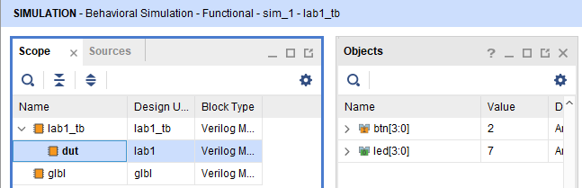

<i>Selecting lower-level signals</i>

2. Select **btn[3:0]** and **led[3:0]** and drag them into the waveform window to monitor those lower-level signals.

3. On the simulator tool buttons ribbon bar, type 500 over in the simulation run time field,  click on the drop-down button of the units field and select ns since we want to run for 500 ns (total of 700 ns), and click on the (   ) button. The simulation will run for an additional 500 ns.     
4. Click on the *Zoom Fit* button and observe the output.

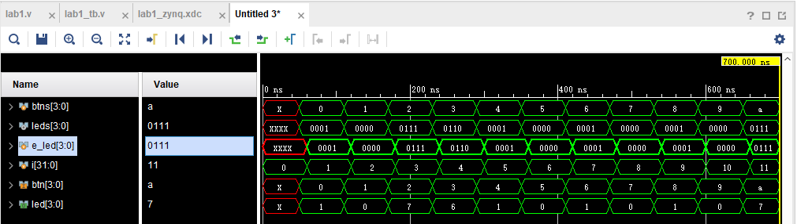

<i>Running simulation for additional 500 ns</i>

Observe the Tcl Console window and see the output is being displayed as the testbench uses the $display task.

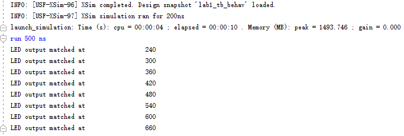

<i>Tcl Console output after running the simulation for additional 500 ns</i>

5. Close the simulator by selecting **File > Close Simulation**. 

6. Click **OK** and then click **Discard** to close it without saving the waveform.

### Synthesize the Design

#### Synthesize the design with the Vivado synthesis tool and analyze the Project Summary output. 

1. Click on **Run Synthesis** under the *SYNTHESIS* tasks of the *Flow Navigator* pane.

   The synthesis process will be run on the lab1.v file (and all its hierarchical files if they exist).  When the process is completed a *Synthesis Completed* dialog box with three options will be displayed.

2. Select the *Open Synthesized Design* option and click **OK** as we want to look at the synthesis output before progressing to the implementation stage.

   Click **Yes** to close the elaborated design if the dialog box is displayed.

3. Select the **Project Summary** tab and understand the various windows.

   If you don’t see the Project Summary tab then select **Window > Project Summary** or click the **Project Summary** icon.

   

   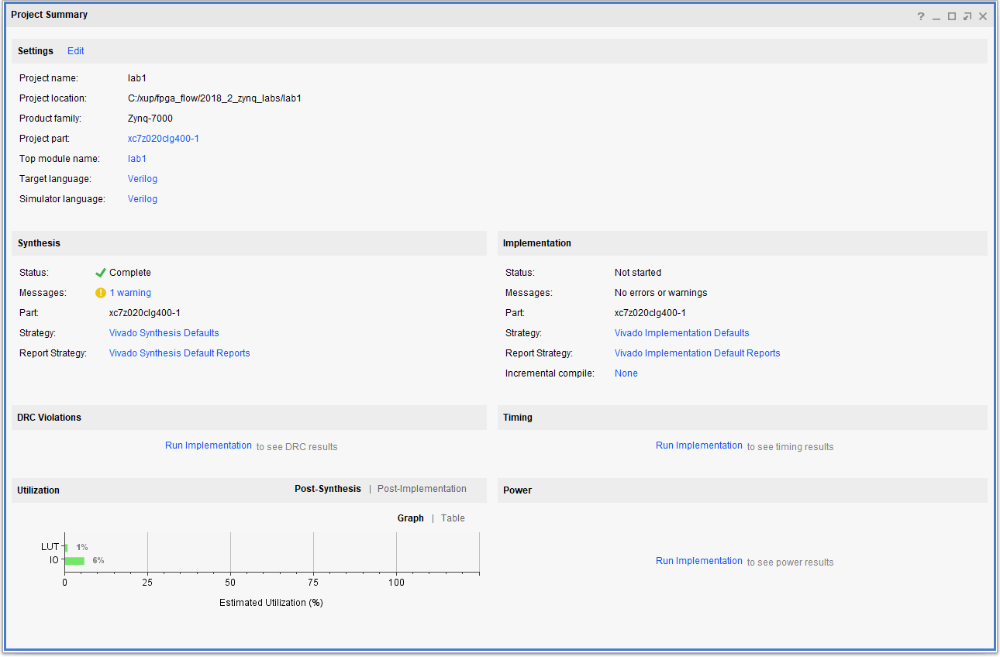
   

   

   <i>Project Summary view </i>
   

   Click on the various links to see what information they provide and which allows you to change the synthesis settings.

4. Click on the **Table** tab in the **Project Summary** tab.

   Notice that there are an estimated 3 LUTs and 8 IOs (4 input and 4 output) that are used.

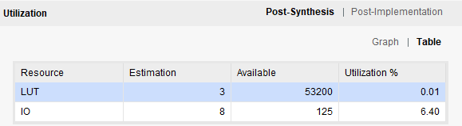

<i>Resource utilization estimation summary</i>

5. In The *Flow Navigator*, under *Synthesis* (expand *Open* *Synthesized Design* if necessary), click on **Schematic** to view the synthesized design in a schematic view.

   

   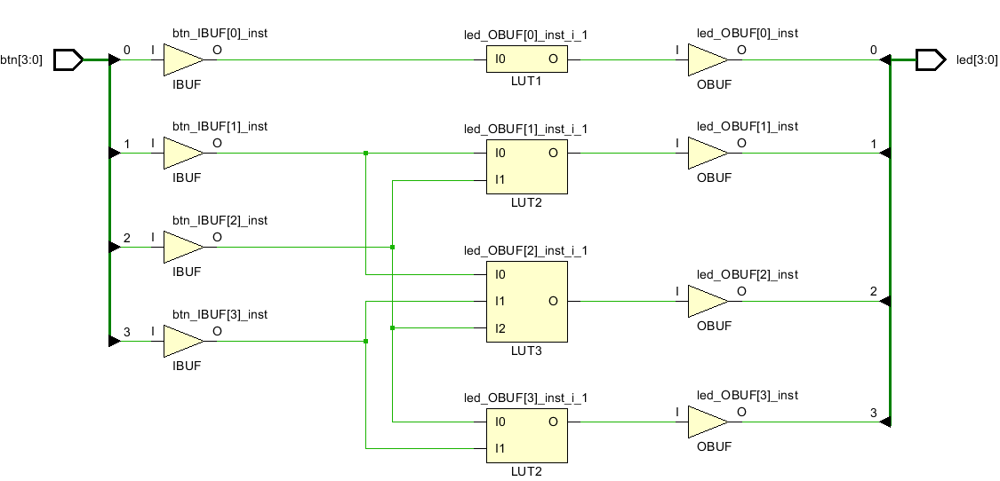
   

   

   <i>Synthesized design’s schematic view</i>
   

   Notice that IBUFs and OBUFs are automatically instantiated (added) to the design as the input and output are buffered.  The logical gates are implemented in LUTs (1 input is listed as LUT1, 2 input is listed as LUT2, and 3 input is listed as LUT3).  Four gates in RTL analysis output are mapped onto four LUTs in the synthesized output.

   Using Windows Explorer, verify that **lab1.runs** directory is created under **lab1**.  Under the **runs** directory, **synth\_1** directory is created which holds several files related to synthesis.

   

   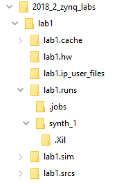
   

<i>Directory structure after synthesizing the design</i>

### Implement the Design

#### Implement the design with the Vivado Implementation Defaults settings and analyze the Project Summary output.    

1. Click on **Run Implementation** under the *Implementation* tasks of the *Flow Navigator* pane.

The implementation process will be run on the synthesized design.  When the process is completed an *Implementation Completed* dialog box with three options will be displayed.

2. Select **Open implemented design** and click **OK** as we want to look at the implemented design in a Device view tab.

3. Click **Yes,** if prompted, to close the synthesized design.  The implemented design will be opened. 
4. In the *Netlist* pane, select one of the nets (e.g. led\_OBUF[3]) and notice that the net displayed in the X1Y2 clock region in the Device view tab (you may have to zoom in to see it).

5. If it is not selected, click the *Routing Resources* icon 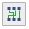 to show routing resources. 

   

   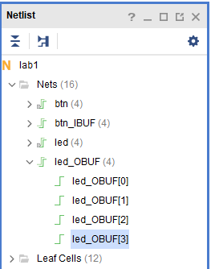
   

   

   <i>Viewing implemented design</i>
   

<i>Selecting a net</i>

   

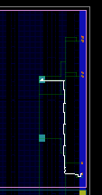

<i>Selecting a net</i>

6. Close the implemented design view by selecting **File > Close Implemented Design**, and select the **Project Summary** tab (you may have to change to the Default Layout view) and observe the results.

7. Select the Post-Implementation tab.

   **Notice** that the actual resource utilization is 3 LUTs and 8 IOs.  Also, it indicates that no timing constraints were defined for this design (since the design is combinatorial).

   

   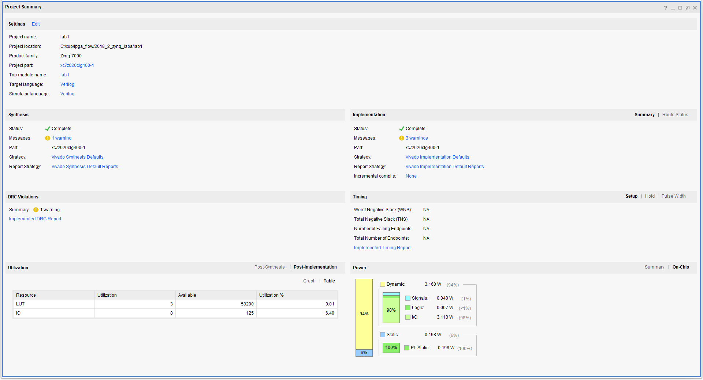
   

   

   <i>Implementation results for the PYNQ-Z1 and PYNQ-Z2</i>
   

   Using the Windows Explorer, verify that **impl\_1** directory is created at the same level as **synth\_1** under the **lab1.runs** directory.  The **impl\_1** directory contains several files including the implementation report files.

8. In Vivado, select the **Reports** tab in the bottom panel (if not visible, click *Window* in the menu bar and select **Reports**), and double-click on the *Utilization Report* entry under the *Place Design* section. The report will be displayed in the auxiliary view pane showing resource utilization.  Note that since the design is combinatorial no registers are used.

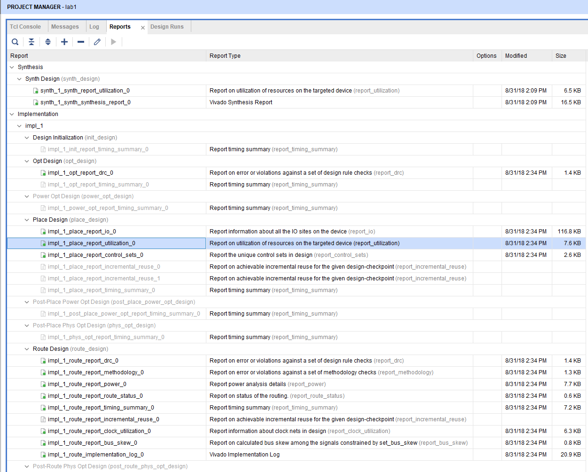

<i>Available reports to view</i>

					

### Perform Timing Simulation

#### Run a timing simulation.  

1. Select **Run Simulation > Run Post-Implementation Timing Simulation** process under the *Simulation* tasks of the *Flow Navigator* pane.

   The Vivado simulator will be launched using the implemented design and **lab1\_tb** as the top-level module.

   Using the Windows Explorer, verify that **timing** directory is created under the **lab1.sim > sim\_1 > impl** directory.  The **timing** directory contains generated files to run the timing simulation.

2. Click on the **Zoom Fit** button to see the waveform window from 0 to 200 ns.

3. Right-click at 50 ns (where the btns input is set to 0000b) and select **Markers > Add Marker**.  

4. Similarly, right-click and add a marker at around 58.000 ns where the **leds** changes.

5. You can also add a marker by clicking on the Add Marker button (   ). Click on the **Add Marker** button and left-click at around 60 ns where **e\_led** changes.

   

   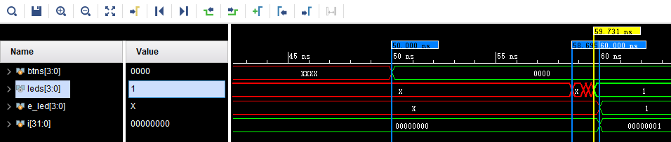
   

   

   <i>Timing simulation output</i>
   

   Notice that we monitored the expected led output at 10 ns after the input is changed (see the testbench) whereas the actual delay is about 8 to 9.7 ns (depending on the board).

6. Close the simulator by selecting **File > Close Simulation** without saving any changes.

### Generate the Bitstream and Verify Functionality

#### Connect the board and power it ON. Generate the bitstream, open a hardware session, and program the FPGA.  

1. Make sure that the Micro-USB cable is connected to the JTAG PROG connector.

2. The PYNQ-Z1 and PYNQ-Z2 can be powered through USB power via the JTAG PROG.

   Make sure that the board is set to use USB power.

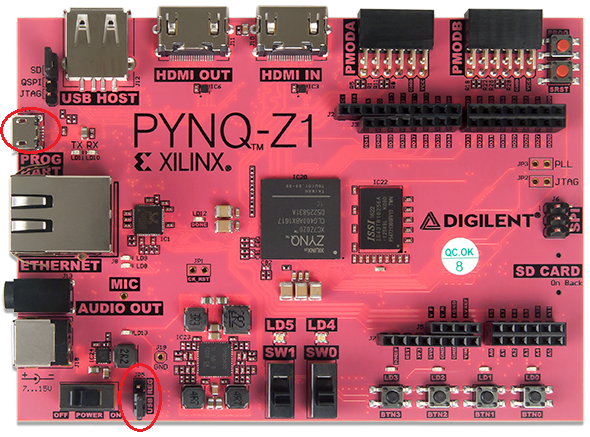

<i>Board connection for the PYNQ-Z1</i>

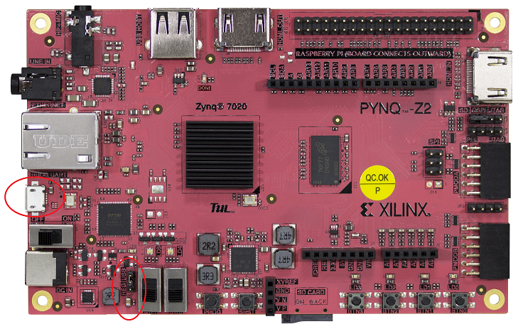

<i>Board connection for the PYNQ-Z2</i>

3. Power **ON** the board.

4. Click on the **Generate Bitstream** entry under the *PROGRAM AND DEBUG* tasks of the *Flow Navigator* pane.

   The bitstream generation process will be run on the implemented design.  When the process is completed a *Bitstream Generation  Completed* dialog box with three options will be displayed.  

   

   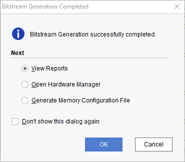
   

   

   <i>Bitstream generation</i>
   

   This process will have generated a **lab1.bit** file under the **impl\_1** directory in the **lab1.runs** directory.

5. Select the *Open Hardware Manager* option and click **OK**.

   The Hardware Manager window will open indicating “unconnected” status.

6. Click on the **Open target** link.

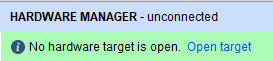

<i>Opening new hardware target</i>

7. From the dropdown menu, click **Auto Connect.**

   The Hardware Session status changes from Unconnected to the server name and the device is highlighted. Also notice that the Status indicates that it is not programmed.

   

   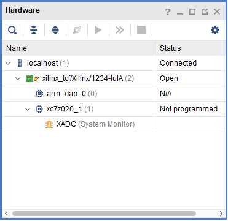
   

   

   <i>Opened hardware session</i>
   

   Select the device and verify that the lab1.bit is selected as the programming file in the General tab.

   

   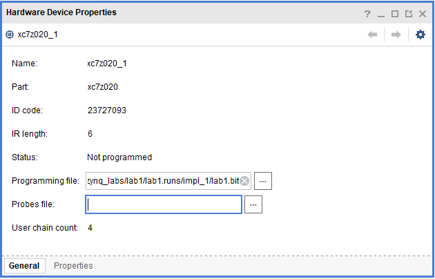
   

   

   <i>Programming file</i>
   

8. Click on the *Program device* link in the green information bar to program the target FPGA device. Another way is to right click on the device and select *Program Device.*

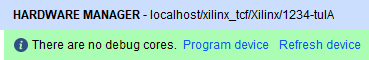

<i>Selecting to program the FPGA</i>

9. Click **Program** to program the FPGA.

   The DONE LED will lit when the device is programmed. You may see some other LEDs lit depending on switch positions.

10. Verify the functionality by flipping the switches and observing the output on the LEDs (Refer to the earlier logic diagram).

11. When satisfied, power **OFF** the board.

12. Close the hardware session by selecting **File > Close Hardware Manager.** 

13. Click **OK** to close the session.

14. Close the **Vivado** program by selecting **File > Exit** and click **OK**.

## Conclusion 

The Vivado software tool can be used to perform a complete HDL based design flow.  The project was created using the supplied source files (HDL model and user constraint file). A behavioral simulation using the provided testbench was done to verify the model functionality. The model was then synthesized, implemented, and a bitstream was generated.  The timing simulation was run on the implemented design using the same testbench. The functionality was verified in hardware using the generated bitstream.  
