# Synthesizing a RTL Design

## Objectives 

After completing this lab, you will be able to:

- Use the provided Xilinx Design Constraint (XDC) file to constrain the timing of the circuit

- Elaborate the design and understand the output

- Synthesize the design with the provided basic timing constraints

- Analyze the output of the synthesized design

- Change the synthesis settings and see their effects on the generated output

- Write a checkpoint after the synthesis so the results can be analyzed after re-loading it

## Steps
### Create a Vivado Project using IDE 

In this design we will use board’s USB-UART which is controlled by the Zynq’s ARM Cortex-A9 processor.  Our PL design needs access to this USB-UART. So first thing we will do is to create a Processing System (PS) design which will put the USB-UART connections in a simple GPIO-style and make it available to the PL section.

#### Launch Vivado and create a project targeting the XC7Z020clg400-1 device, and use provided the tcl scripts (ps7\_create\_pynq.tcl) to generate the block design for the PS subsystem. Also, add the Verilog HDL files, uart\_led\_pins\_pynq.xdc and uart\_led\_timing.xdc files from the < *2018\_2\_zynq\_sources >\lab2* directory.

 **<2018\_2\_zynq\_labs>** refers to **C:\xup\fpga\_flow\2018\_2\_zynq\_labs** directory and **<2018\_2\_zynq\_sources>** refers to **C:\xup\fpga\_flow\2018\_2\_zynq\_sources** directory.     

1. Open Vivado by selecting **Start > Xilinx Design Tools > Vivado 2018.2**

2. Click **Create New Project** to start the wizard. You will see *Create A New Vivado Project* dialog box. Click **Next**.

3. Click the Browse button of the *Project location* field of the **New Project** form, browse to **<2018\_2\_zynq\_labs>**, and click **Select**.

4. Enter **lab2** in the *Project name* field.  Make sure that the *Create Project Subdirectory* box is checked.  Click **Next**.

5. Select **RTL Project** option in the *Project Type* form and click **Next**.

6. Using the drop-down buttons, select **Verilog** as the *Target Language* and *Simulator Language* in the *Add Sources* form.

7. Click on the **Blue Plus** button, then the **Add Files…** button and browse to the **<2018\_2\_zynq\_sources>\lab2** directory, select all the Verilog files *(led\_ctl.v, meta\_harden.v, uart\_baud\_gen.v, uart\_led.v, uart_rx.v, uart\_rx\_ctl.v and uart\_top.v),* click **OK**, and then click **Next** to get to the *Add Constraints* form.

8. Click on the **Blue Plus** button, then **Add Files…** and browse to the **<2018\_2\_zynq\_sources>\lab2** directory (if necessary), select *uart\_led\_timing\_pynq.xdc* and click **Open**.

9. Click **Next.**

   This Xilinx Design Constraints file assigns the basic timing constraints (period, input delay, and output delay) to the design. 

10. In the *Default Part* form, Use the **Boards** option, you may select the **PYNQ-Z1** or the **PYNQ-Z2** depending on your board from the Display Name drop down field.

    You may also use the **Parts** option and various drop-down fields of the **Filter** section. Select the **XC7Z020clg400-1 part**. 

    **Note: Notice that PYNQ-Z1 and PYNQ-Z2 may not be listed under Boards menu as they are not in the tools database. If not listed then you can download the board files for the desired boards either from Digilent PYNQ-Z1 web page or TUL PYNQ-Z2 web page**.

11. Click **Next**.

12. Click **Finish** to create the Vivado project.  

13. In the Tcl Shell window enter the following command to change to the lab directory and hit **Enter**.

    *cd C:/xup/fpga\_flow/2018\_2\_zynq_sources/lab2*

14. Generate the PS design by executing the provided Tcl script.

    *source ps7\_create\_pynq.tcl*

    This script will create a block design called *system*, instantiate ZYNQ PS with one GPIO channel (GPIO14) and one EMIO channel. It will then create a top-level wrapper file called system\_wrapper.v which will instantiate the system.bd (the block design). You can check the contents of the tcl files to confirm the commands that are being run. 

#### Analyze the design source files hierarchy.

1. In the *Sources* pane, expand the **uart\_led** entry and notice hierarchy of the lower-level modules.

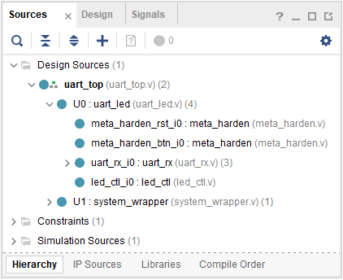

<i>Opening the source file</i>

2. Double-click on the **uart\_led** entry to view its content.

   Notice in the Verilog code, the BAUD\_RATE and CLOCK\_RATE parameters are defined to be 115200 and 125 MHz respectively as shown in the design diagram. Also notice that the lower level modules are instantiated. The meta\_harden modules are used to synchronize the asynchronous reset and push-button inputs.

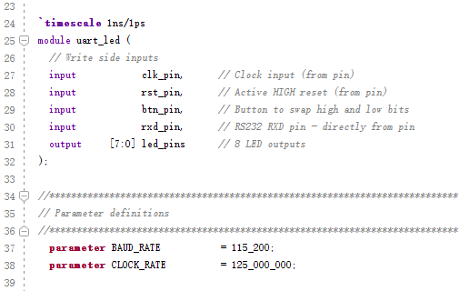

<i>CLOCK\_RATE parameter of uart\_led for the PYNQ board</i>

3. Expand **U0** and **uart\_rx\_i0** instance to see its hierarchy. 

This module uses the baud rate generator and a finite state machine. The rxd\_pin is sampled at a x16 the baud rate.

#### Open the uart\_led\_timing\_pynq.xdc source and analyze the content

1. In the *Sources* pane, expand the *Constraints* folder and double-click the **uart\_led\_timing\_pynq.xdc** entry to open the file in text mode.

   

   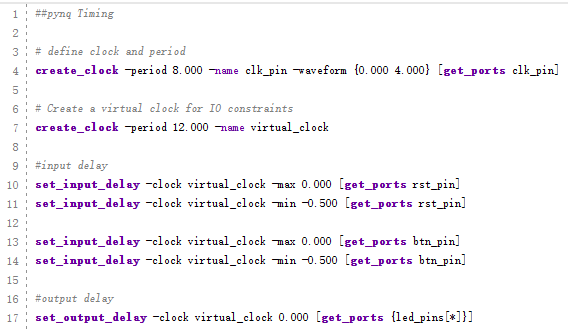
   

   

   <i>Timing constraints</i>
   

Line 4 creates the period constraint of 8ns with a duty cycle of 50%. Line 7 creates a virtual clock of 12 ns. This clock can be viewed as the upstream device is generating its output with respect to its clock and outputs data with respect to it. The btn\_pin is constrained with respect to the upstream clock (lines 13, 14).  The led\_pins are constrained with respect to the upstream clock as the downstream device may be using it.

### Elaborate the Design

#### Elaborate and perform the RTL analysis on the source file.

1. Click **Flow Navigator > RTL ANALYSIS > Open Elaborated Design > Schematic**. Click **OK**.

   The model (design) will be elaborated and a logical view of the design is displayed.

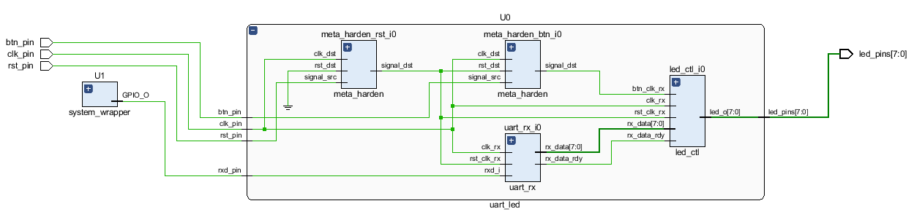

<i>A logic view of the design one-level down from the top in component U0</i>

   

You will see two components at the top-level; going down one level in component U0 shows 2 instances of meta\_harden, one instance of uart\_rx, and one instance of led\_ctl. 

2. To see where the uart\_rx\_i0 gets generated, right-click on the uart\_rx\_i0 instance and select *Go To Source* and see that line 84 in the source code is generating it.

3. Double-click on the uart\_rx\_i0 instance in the schematic diagram to see the underlying components.

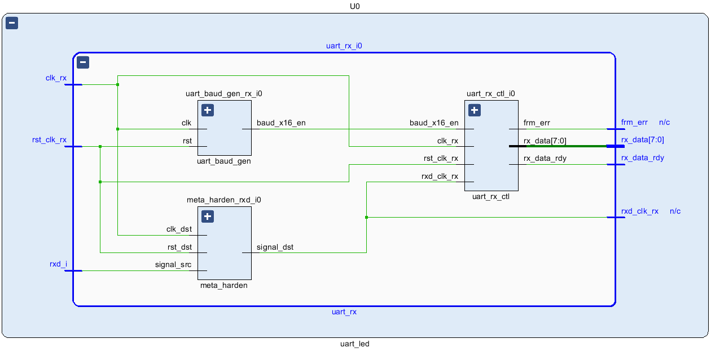

<i>Lower level components of the uart\_rx\_i0 module</i>

  

4. Click on **Flow Navigator > RTL Analysis > Open Elaborated Design > Report Noise**.

5. Click **OK** to generate the report named **ssn\_1**.

6. View the ssn\_1 report and observe the unplaced ports, Summary, and I/O Bank Details are highlighted in red because the pin assignments were not done.  Note that only output pins are reported as the noise analysis is done on the output pins.

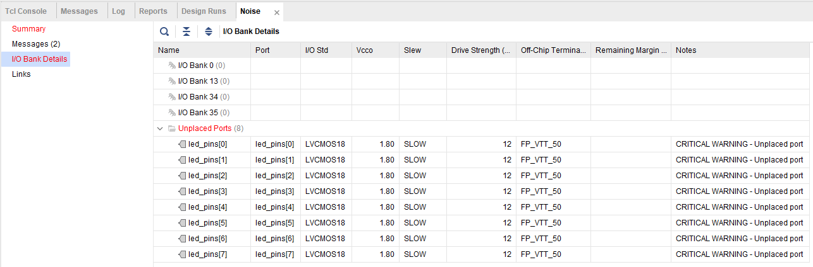

<i>Noise report</i>

7. Click on **Add Sources** under the *Project Navigator*, select *Add or create constraints* option and click **Next**.

8. Click on the **Blue Plus** button, then the **Add Files…** button and browse to the **<2018\_2\_zynq\_sources>\lab2** directory, select the **uart\_led\_pins\_pynq.xdc** file, click **OK**, and then click **Finish** to add the pins location constraints.

   Notice that the sources are modified and the tools detect it, showing a warning status bar to re-load the design.

9. Click on the **Reload** link. The constraints will be processed.

10. Click on **Report Noise** and click **OK** to generate the report named **ssn\_1**.  Observe that this time it does not show any errors (no red). 

### Synthesize the Design

#### Synthesize the design with the Vivado synthesis tool and analyze the Project Summary output.    

1. Click on **Flow Navigator > SYNTHESIS > Run Synthesis**.

   Click **Save** if the Save Project dialog box is displayed.

   The synthesis process will be run on the uart\_top.v and all its hierarchical files.  When the process is completed a *Synthesis Completed* dialog box with three options will be displayed.

2. Select the *Open Synthesized Design* option and click **OK** as we want to look at the synthesis output.

   Click **Yes** to close the elaborated design if the dialog box is displayed.

3. Select the **Project Summary** tab

   If you don’t see the Project Summary tab then select **Layout > Default Layout,** or click the **Project Summary** icon.    

4. Click on the **Table** tab in the **Project Summary** tab and fill out the following information.

**Question 1**

Look through the table and find the number used of each of the following: 

| Resource | Number |
| :-------- | ------: |
| FF | ______ |
| LUT | ______ |
| I/O | ______ |
| BUFG | ______ |

5. Click on **Flow Navigator > SYNTHESIS > Open Synthesized Design > Schematic** to view the synthesized design in a schematic view.

   

   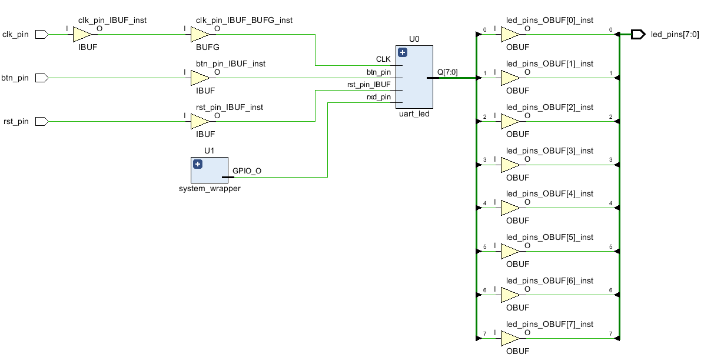
   

   

   <i>Synthesized design’s schematic view</i>
   

   Notice that IBUF and OBUF are automatically instantiated (added) to the design as the input and output are buffered.  There are still four lower level modules instantiated.

6. Double-click on **U0** and **uart\_rx\_i0** instances in the schematic view to see the underlying instances. 

7. Select the **uart\_baud\_gen\_rx\_i0** instance, right-click, and select *Go To Source*.

   Notice that line 86 is highlighted.  Also notice that the CLOCK\_RATE and BAUD\_RATE parameters are passed to the module being called.

8. Double-click on the **meta\_harden\_rxd\_i0** instance to see how the synchronization circuit is being implemented using two FFs.  This synchronization is necessary to reduce the likelihood of meta-stability.  

9. Click on the (   ) in the schematic view to go back to its parent block.

#### Analyze the timing report.    

1. Click on **Flow Navigator > SYNTHESIS > Open Synthesized Design > Report Timing Summary**.

2. Click **OK** to generate the Timing\_1 report.

   

   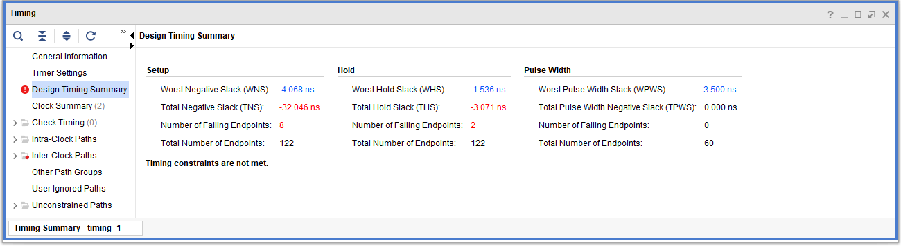
   

   

   <i>Timing report for the PYNQ</i>
   

   Notice that the Design Timing Summary and Inter-Clock Paths entry in the left pane is highlighted in red indicating timing violations. In the right pane, the information is grouped in Setup, Hold, and Width columns.

   Under the Setup column Worst Negative Slack (WNS) is linked indicating that clicking on it can give us insight on how the failing path has formed.  The Total Negative Slack (TNS) is highlighted in red indicating the total amount of violations in the design and the Number of Failing Endpoints indicate total number of failing paths. 

3. Click on the WNS link and see the 8 failing paths.

   

   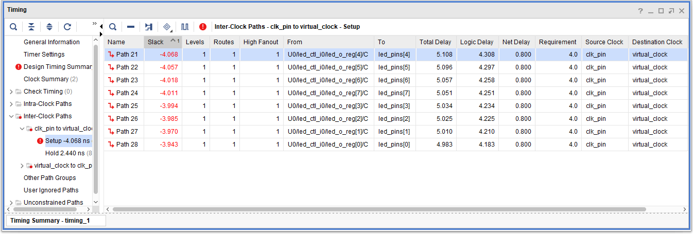
   

   

   <i>The 8 failing paths for the PYNQ</i>
   

   Double-click on the Path 25 to see how the path is made.

   

   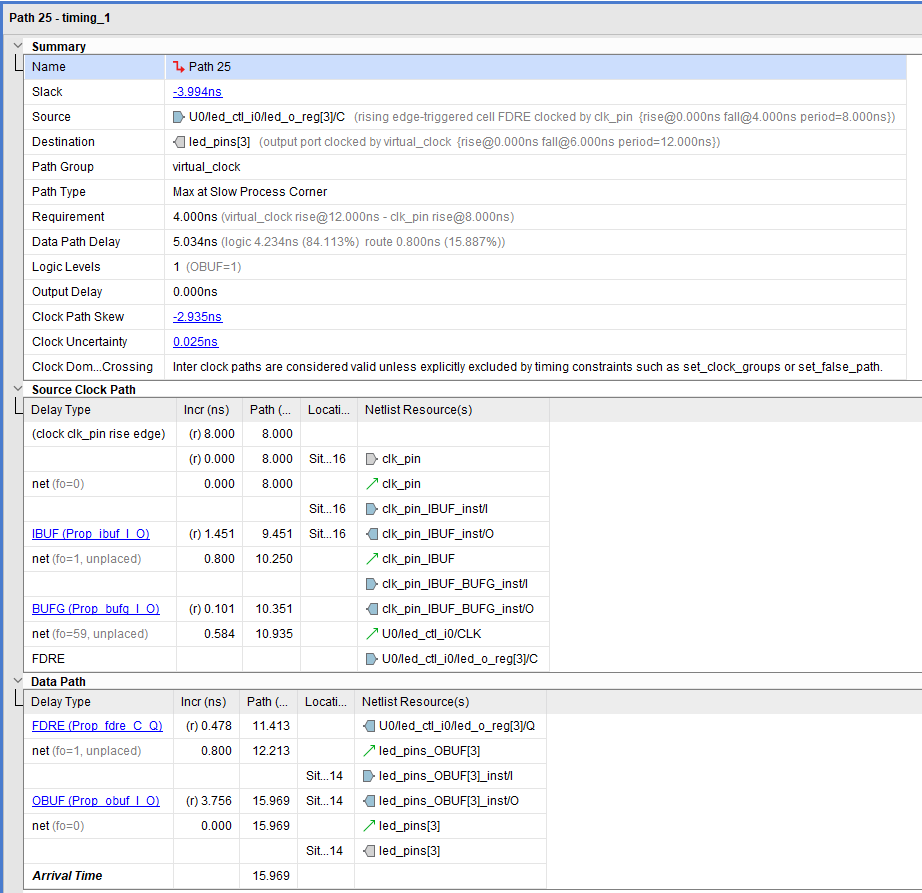
   

   

   <i>Worst failing path for the PYNQ</i>
   

   Note that this is an estimate only. The nets are specified as unplaced and have all been allocated default values (0.584 ns). No actual routing delays are considered.

#### Generate the utilization and power reports.

1. Click **Flow Navigator > SYNTHESIS > Open Synthesized Design > Report Report Utilization**, and click **OK** to generate the utilization report.  Click on **Summary** in the left pane.

   

   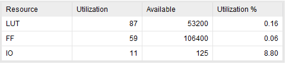
   

   

   <i>Utilization report for the PYNQ</i>
   

**Question 2**

Look through the report and find the number used of each of the following: 

| Resource | Number |
| :-------- | ------: |
| FF: | ______ |
| LUT: | ______ |
| I/O: | ______ |
| BUFG: | ______ |

2. Select Slice LUTs entry in the left pane and see the utilization by lower-level instances. You can expand the instances in the right pane to see the complete hierarchy utilization.

   

   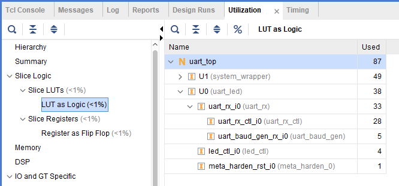
   

   

   <i>Utilization of lower-level modules for the PYNQ</i>
   

3. Click **Flow Navigator > SYNTHESIS > Open Synthesized Design > Report Power**, and click **OK** to generate the estimated power consumption report using default values.

   Note that this is just an estimate as no simulation run data was provided and no accurate activity rate, or environment information was entered.

   

   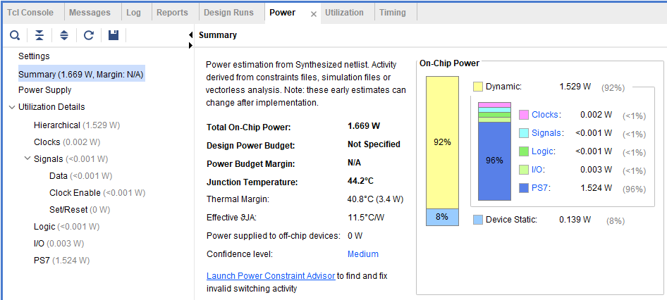
   

   

   <i>Power consumption estimation for the PYNQ</i>
   

**Question 3**

From the power report, find the % power consumption used by each of the following: 

| Resource | Number |
| :-------- | ------: |
| Clocks: | ______ |
| Signals: | ______ |
| Logic: | ______ |
| I/O: | ______ |
| PS7: | ______ |

   You can move the mouse on the boxes which do not show the percentage to see the consumption.

### Write the checkpoint to analyze the results without going through the actual synthesis process.    

1. Select **File > Checkpoint > Write…** to save the processed design so it can be opened later for further analysis.

2. A dialog box will appear showing the default name of the file in the current project directory.

   

   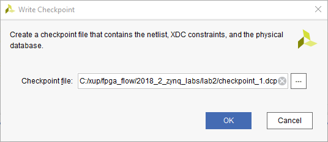
   

   

   <i>Writing checkpoint</i>
   

3. Click **OK**.

### Change the synthesis settings to flatten the design. Re-synthesize the design and analyze the results

1. Click on the **Settings** under the *Project Manager*, and select **Synthesis**.

2. Click on the **flatten\_hierarchy** drop-down button and select **full** to flatten the design.

   

   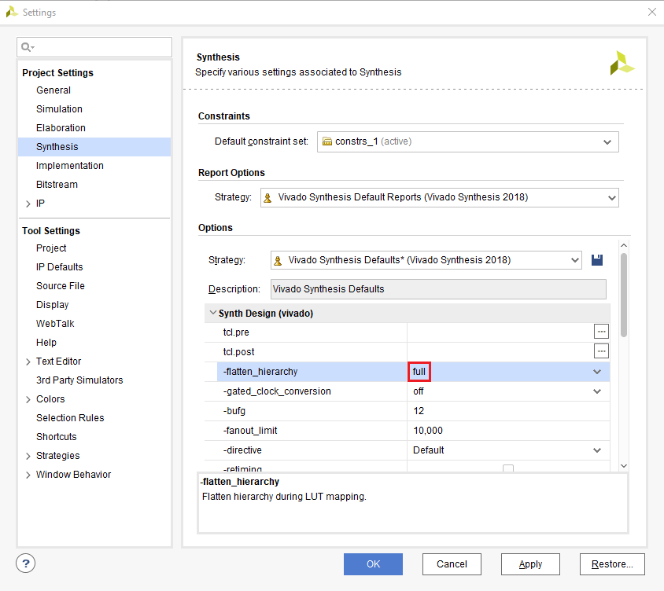
   

   

   <i>Selecting flatten hierarchy option</i>
   

3. Click **OK**.

4. A Create New Run dialog box will appear asking you whether you want to create a new run since the settings have been changed.

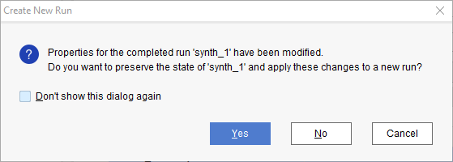

<i>Create New Run dialog box</i>

5. Click **Yes**.

6. Change the name from **synth\_2** to **synth\_flatten** and click **OK**.

7. Click **Run Synthesis** to synthesize the design.

8. Click **Save**, **OK**, and again **OK** to save the synthesized design and save the constraints.

   The Reload Design dialog box may re-appear.  Click **Cancel**.

9. Click **OK** to open the synthesized design when synthesis process is completed.

10. Click on **Flow Navigator > SYNTHESIS > Open Synthesized Design > Schematic** to view the synthesized design in a schematic view.

    Notice that the design is completely flattened.

    

    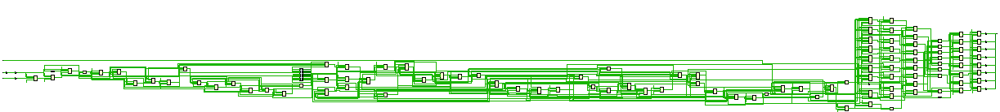
    

    

    <i>Flattened design</i>
    

11. Click on **Report Utilization** and observe that the hierarchical utilization is no longer available.  Also note that the number of **Slice Registers** is **59**.

### Write the checkpoint to analyze the results without going through the actual synthesis process

1. Select **File > Checkpoint > Write…** to save the processed design so it can be opened later for further analysis.

2. A dialog box will appear showing the default name of the file (checkpoint\_2.dcp) in the current project directory.

3. Click **OK**.

4. Close the project by selecting **File > Close Project**.

### Read the Checkpoints 

#### Read the previously saved checkpoint (checkpoint\_1) in order to analyze the results without going through the actual synthesis process

1. Select **File > Checkpoint > Open…** at the *Getting Started* screen.

2. Browse to **<2018\_2\_zynq\_labs>\lab2** and select **checkpoint\_1.**

3. Click **OK**.

4. If the schematic isn’t open by default, in the netlist tab, select the **U0**(**uart_led)**, right-click and select **Schematic**.

   You will see the hierarchical blocks.  You can double-click on any of the first-level block and see the underlying blocks.  You can also select any lower-level block in the netlist tab, right-click and select Schematic to see the corresponding level design.

5. In the netlist tab, select the top-level instance, **U0**(**uart\_led)**, right-click and select **Show Hierarchy.**

   You will see how the blocks are hierarchically connected. 

6. Select **Reports > Timing > Report Timing Summary** and click **OK** to see the report you saw previously.

7. Select **Reports > Report Utilization…** and click **OK** to see the utilization report you saw previously 

8. Select **File > Checkpoint > Open**, browse to **<2018\_2\_zynq\_labs >\lab2** and select **checkpoint\_2.**

9. Click **No** to keep the Checkpoint\_1 open. 

   This will invoke second Vivado GUI.

10. If the schematic isn’t open by default, in the netlist tab, select the top-level instance, **uart\_top**, right-click and select **Schematic**.

    You will see the flattened design.

11. You can generate the desired reports on this checkpoint as you wish.

12. Close the **Vivado** program by selecting **File > Exit** and click **OK**.

## Conclusion 

In this lab you applied the timing constraints and synthesized the design.  You viewed various post-synthesis reports.  You wrote checkpoints and read it back to perform the analysis you were doing during the design flow. You saw the effect of changing synthesis settings.  

**Answers** 

1. Look through the table and find the number used of each of the following:

| Resource | Number |
| :-------- | ------: |
| FF | 59 |
| LUT | 87 |
| I/O | 11 |
| BUFG | 1 |

2. Look through the table and find the number used of each of the following:

| Resource | Number |
| :-------- | ------: |
| FF | 59 |
| LUT | 87 |
| I/O | 11 |
| BUFG | 1 |

3. From the power report, find the % power consumption used by each of the following:

| Resource | Number |
| :-------- | ------: |
| Clocks: | <1% |
| Signals: | <1% |
| Logic: | <1% |
| I/O: | <1% |
| PS7: | <96% |
