# Implementing the Design

## Objectives 

After completing this lab, you will be able to:

- Implement the design

- Generate various reports and analyze the results

- Run static timing analysis

- Generate bitstream and verify the functionality in hardware

## Steps
### Open a Vivado Project using IDE

#### Launch Vivado and open the lab2 project. Save the project as lab3 in the *<2018\_2\_zynq\_labs>* directory making sure that the create subdirectory option is selected.  Set the flatten_hierarchy setting to rebuilt. Create new synthesis run naming it as synth\_2.

 **<2018\_2\_zynq\_labs>** refers to the **C:\xup\fpga_flow\2018\_2\_zynq\_labs** directory and **<2018\_2\_zynq   \_sources>** to the **C:\xup\fpga\_flow\2018\_2\_zynq\_sources** directory. 

1. Start the Vivado if necessary and open the lab2 project (lab2.xpr) you created in the previous lab using the **Open Project** link in the Getting Started page.

2. Select **File > Project > Save As …** to open the *Save Project As* dialog box. Enter **lab3** as the project name.  Make sure that the *Create Project Subdirectory* option is checked, the project directory path is **<2018\_2\_zynq\_labs>** and click **OK.**

3. Click on the **Settings** in the *Flow Navigator* pane.

4. Make sure that the *Synthesis > flatten\_hierarchy* is set to **rebuilt**, which allows the design hierarchy to be preserved for synthesis, and then rebuilt which is more useful for design analysis because many logical references will be maintained.

   

   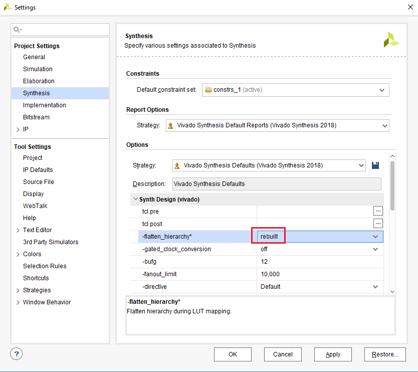
   

   

   <i>Setting hierarchy to rebuilt</i>
   

5. Click **OK**.

   A Create New Run dialog box will appear asking you if a new run should be created.  Click **Yes** and then **OK** to create the new run with **synth\_2** name.

### Synthesize the design. Generate the timing summary and analyze the design.

1. Click on **Run Synthesis** under the *Synthesis* tasks of the *Flow Navigator* pane.

   The synthesis process will be run on the uart\_top.v and all its hierarchical files.  When the process is completed a *Synthesis Completed* dialog box with three options will be displayed.

2. Select the *Open Synthesized Design* option and click **OK** as we want to look at the synthesis output.

3. Click on **Report Timing Summary** under the *Synthesized Design* tasks of the *Flow Navigator* pane.

4. Leave all the settings unchanged, and click **OK** to generate a default timing report, *timing\_1.*

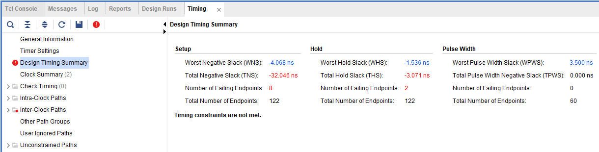

<i>Timing report for the PYNQ</i>

5. Click on the link beside the **Worst Negative Slack** (WNS) and see the 8 failing paths.

6. Double-click on the Path 25 to see a detailed view of the path.  The path report shows four sections: (i) Summary, (ii) Source Clock Path, (iii) Data Path, and (iv) Destination Clock Path.

7. Select Path 25 in the timing summary panel, or the Path summary view, right-click, and select **Schematic**.

   The schematic for the output data path will be displayed.

   

   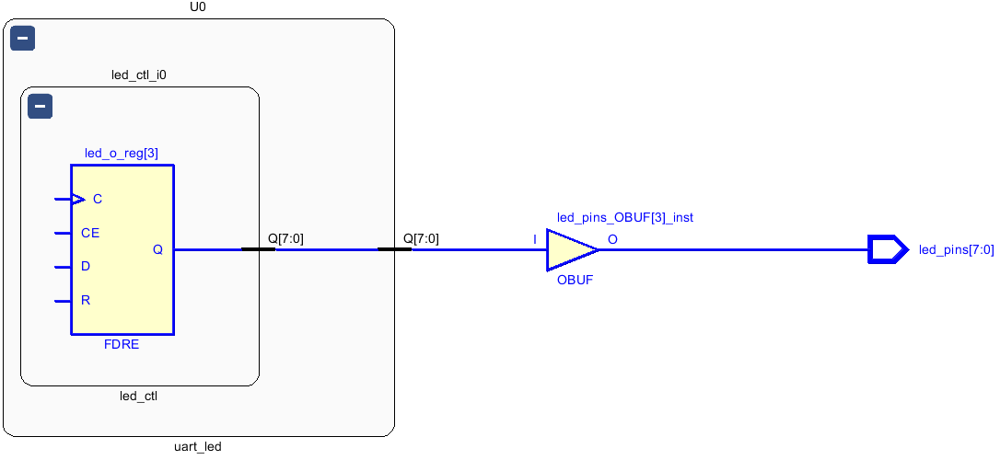
   

   

   <i>The output data path</i>
   

8. In order to see how the Source Clock Path is made up in schematic form, double-click on left end of the C pin of the FDRE in the schematic. 

   This will show the net between the BUFG and C port of the FDRE. 

9. Similarly, double-click on the left end of the BUFG to see the path between IBUF and BUFG.

   

   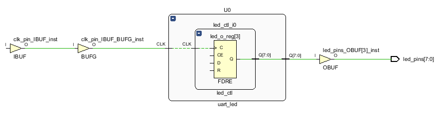
   

   

   <i>Source to clock port of the FDRE</i>
   

10. Finally, double-click on the input pin of IBUF to see the path between the clock input pin and the IBUF.

    

    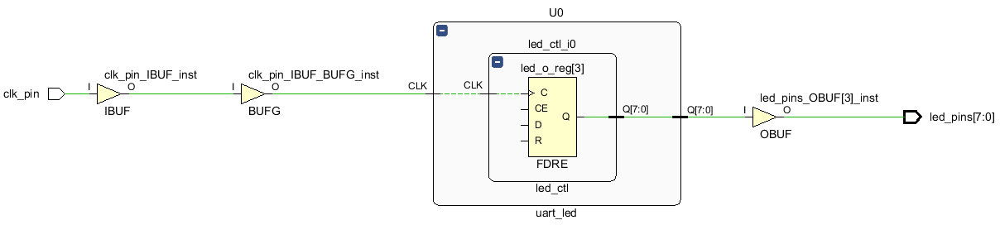
    

    

    <i>The schematic view of the source clock path</i>
    

    This corresponds to the Source Clock Path in the timing report.

    

    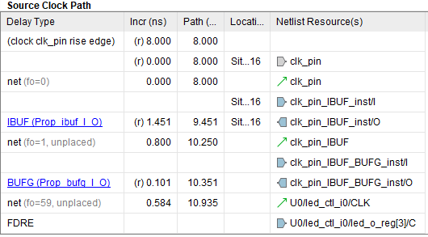
    

    

    <i>The source clock path for the PYNQ</i>
    

    Since the virtual clock is slower (12 ns) than the clk\_pin period (8 ns), the data path delay includes the clock period of the clk\_pin clock source.

    

    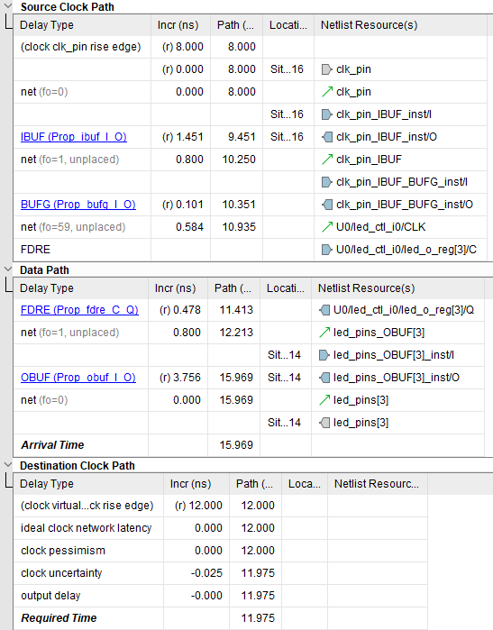
    

    

    <i>Worst failing path for the PYNQ</i>
    

#### Change the design constraint to constrain the virtual clock period to 8ns. Re-synthesize the design and analyze the results.

1. Click **Edit Timing Constraints** under the Synthesized Design.  

   The Timing Constraints GUI will appear, showing the design has two create clocks, four inputs, and one output constraints. It also shows the constraints in the text form in the All Constraints section.

   

   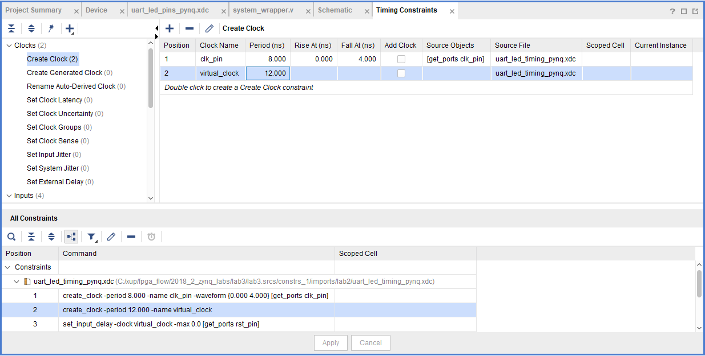
   

   

   <i>Timing Constraints showing 12 ns Virtual Clock period defined</i>
   

2. Click in the Period cell of the virtual\_clock and change the period from 12 to 8 

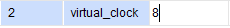

3. Click **Apply**.

   Note that since the timing constraint has changed, a warning message in the console pane is displayed to rerun the report.

4. Click on **Rerun**.

   Notice that setup timing violations are gone. However, there are still 2 failing paths for the Hold.

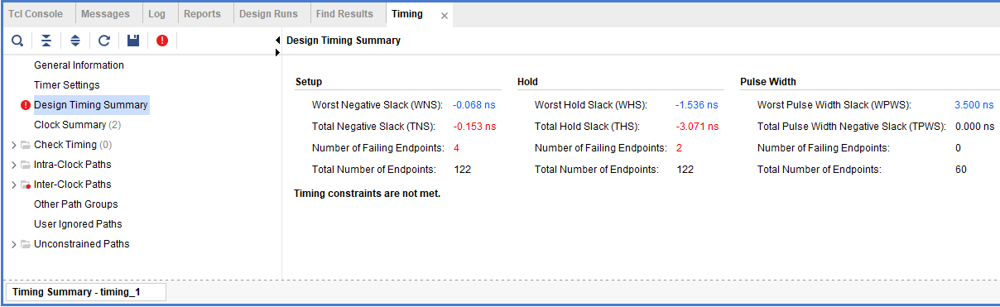

<i>Setup timing met for the PYNQ</i>

5. Click on the WHS link to see the paths.

6. Double-click on the first path to see the timing compositions. Notice that the clock path delay does not include the entire clock period.

7. Select **File > Constraints > Save…**

8. Click **Update.**

9. Click **OK** and then **Yes** to save the synthesized design.

   Notice that the Synthesis Out-of-Date status is displayed on the top-right corner.

### Implement the Design

#### Run the implementation after saving the synthesis run. Perform the timing analysis.    

1. In the Design Runs tab, right-click on the synth\_2 and select **Reset Runs**. Make sure the generated files are deleted. Click **Reset**.

2. Click the **Close Design** link in the status bar. If prompted, do not save anything.

3. Click on the **Run Implementation** in the *Flow Navigator* pane.

4. Click **OK** when prompted to run the synthesis first before running the implementation process.

   When the implementation is completed, a dialog box will appear with three options.  

5. Select the *Open Implemented Design* option and click **OK**.

#### View the amount of FPGA resources consumed by the design using Report Utilization.

1. In the *Flow Navigator* pane, select IMPLEMENTATION > Open Implemented Design > Report Utilization.

   The Report Utilization dialog box opens.

2. Click **OK**.

   The utilization report is displayed at the bottom of the Vivado IDE. You can select any of the resources on the left to view its corresponding utilization.

3. Select Slice LUTs to view how much and which module consumes the resource.

   

   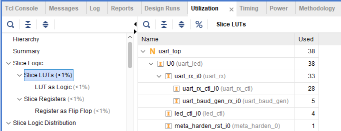
   

   

   <i>Resource utilization for the PYNQ</i>
   

#### Generate a timing summary report

1. Click **Flow Navigator > IMPLEMENTATION > Open Implemented Design > Report Timing Summary** 

   The Report Timing Summary dialog box opens.

2. Leave all the settings unchanged and click **OK** to generate the report. 

<i>The timing summary report showing timing violations</i>

3. Click on the WNS link to see a detailed report to determine the failing path entries.

4. Double-click on the first failing path to see why it is failing.

   

   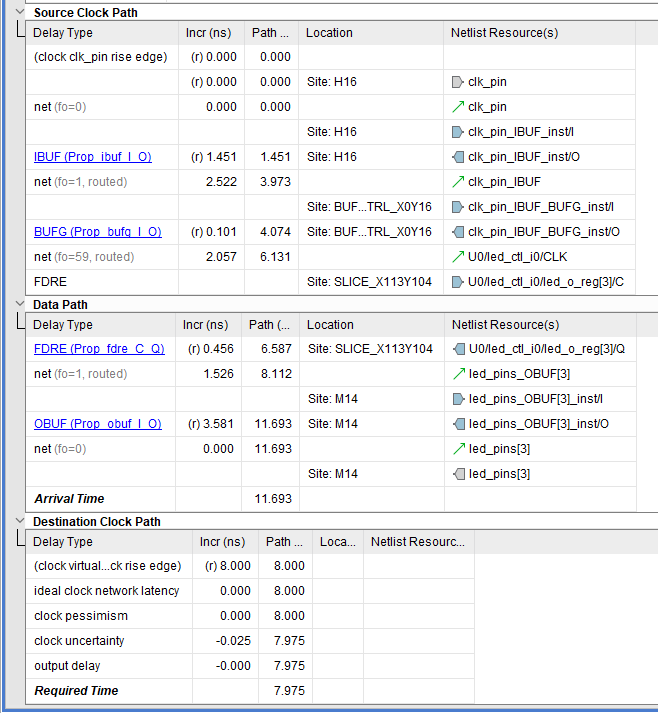
   

   

   <i>First failing path delays for the PYNQ</i>
   

   Compared to delays from the synthesis report, the net delays are actual delays (rather than an estimated figure).  The data path delay is longer than the destination clock path delay giving a negative slack (violation). The data path delay is 11.693 ns for the PYNQ-Z2, the destination clock path is 7.975 ns and the negative slack is -3.718 ns. 

   At this point we can ignore this violation as the LED display change by a few nanoseconds won’t be observable by human eyes.  We can also change the output delay by -4 ns and make the timings meet.

5. Change the output delay by -4 ns and add the following min delay constraint in the uart\_led\_timing\_pynq.xdc file.

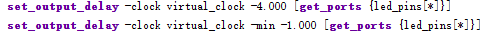

6. Click on **Save File** button to save the modified constraint file and then click on the **Run Implementation** in the *Flow Navigator* pane to implement the project with new constraint file.

7. Click **OK** when prompted to run the synthesis first before running the implementation process.

   When the implementation is completed, a dialog box will appear with three options.  

8. Select the ***Open Implemented Design*** option and click **OK**.

9. Click **Flow Navigator > IMPLEMENTATION > Open Implemented Design > Report Timing Summary**

   Observe that the timing violations of the Intra-clock paths are gone.  

10. Expand the **Intra-Clock Paths** folder on the left, expand *clk\_pin*, and select the Setup group to see the list of 10 worst case delays on the right side.

11. Double-click on the any path to see how that is made up of. Also right-click on it and select **Schematic**.

    Click on the **Device** tab and see the highlighted path in the view.

12. Select **Open Implemented Design > Report Clock Networks**.

13. Click **OK**.

    The Clock Networks report will be displayed in the Console pane showing two clock net entries.

14. Select *clk\_pin* entry and observe the selected nets in the Device view.

    The clock nets are spread across multiple clock regions.

    

    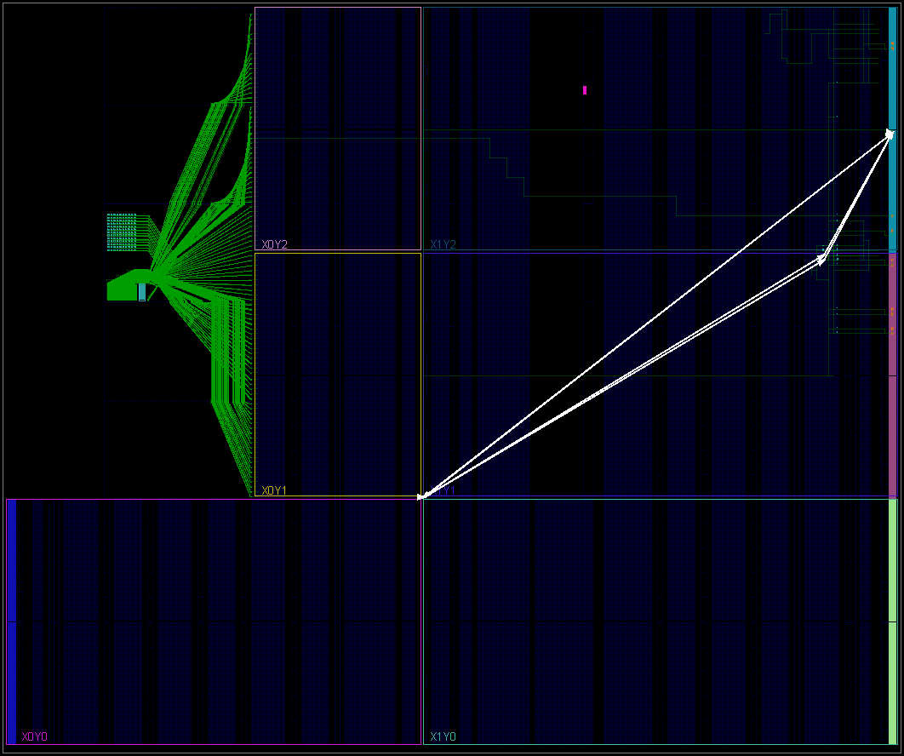
    

    

    <i>Clock nets for the PYNQ-Z2</i>
    

### Generate the Bitstream

1. Click **Flow Navigator > PROGRAM AND DEBUG > Generate Bitstream**.

   

   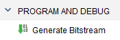
   

   

   <i>Generating the bitstream</i>
   

2. The write\_bitstream command will be executed (you can verify it by looking in the Tcl console).

3. Click **Cancel** when the bitstream generation is completed.

### Verify the Functionality 

#### Connect the board and power it ON. Open a hardware session, and program the FPGA.  

1. Make sure that the Micro-USB cable is connected to the JTAG PROG connector.

2. Select the *Open Hardware Manager* option.

   The **HARDWARE MANAGER** window will open indicating “unconnected” status.

3. Click on the **Open target** link, then **Auto Connect** from the drop down menu.

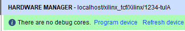

4. The Hardware Session status changes from Unconnected to the server name and the device is highlighted. Also notice that the Status indicates that it is not programmed.

5. Select the device in the *Hardware Device Properties,* and verify that the **uart\_top.bit** is selected as the programming file in the General tab.

6. Click on the FPGA device in the HARDWARE MANAGER window

7. Click on the **Program** button.

   The programming bit file will be downloaded and the DONE light will be turned ON when the FPGA has been programmed.

#### Start a terminal emulator program such as TeraTerm or HyperTerminal. Select an appropriate COM port (you can find the correct COM number using the Control Panel).  Set the COM port for 115200 baud rate communication. 

1. Start a terminal emulator program such as TeraTerm or HyperTerminal. 

2. Select an appropriate COM port (you can find the correct COM number using the Control Panel).  

3. Set the COM port for 115200 baud rate communication. 

#### Program FPGA, Start a SDK session, point it to the *C:/xup/fpga\_flow/2018\_2\_zynq\_sources/lab3/Pynq/lab3.sdk workspace.* 

1. Open **SDK** by selecting **Start >  Xilinx Design Tools > Xilinx SDK 2018.2**

2. In the **Select a drectory as workspace** window, click on the browse button, browse to C:/xup/fpga\_flow/2018\_2\_zynq\_sources/lab3/lab3.sdk directory.

3. In the *Project Explorer*, right-click on the *uart\_led\_zynq*, select *Run As*, and then **Launch on Hardware (System Debugger).**

   

   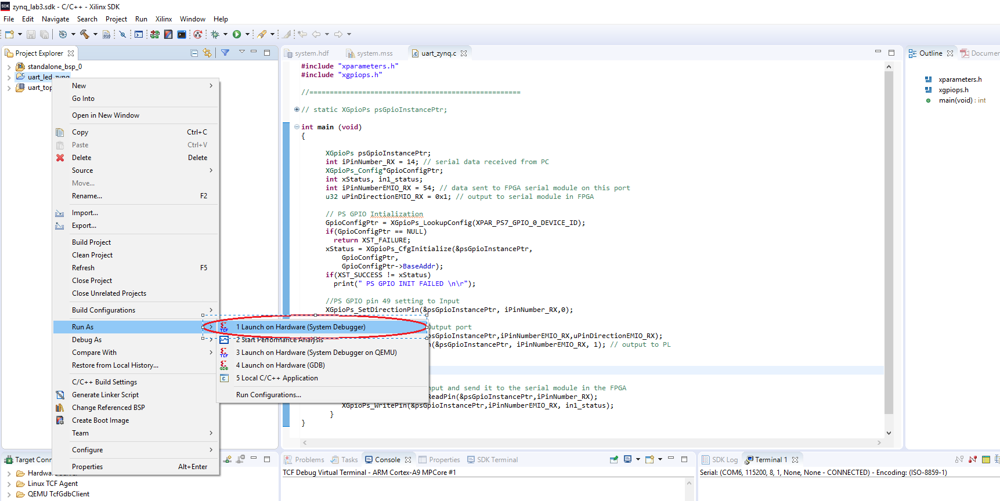
   

   

   <i>Running the application</i>
   

   The program will be downloaded and the execution will begin.

4. In the serial terminal window, type in some characters in the terminal emulator window and see the corresponding ASCII equivalent bit pattern displayed on the LEDs.

   **Note:** You will see the lower four bits on the LEDs

5. Press and hold BTN0 and see the the upper four bits are swapped with the lower four bits on the LEDs

6. When satisfied, close the terminal emulator program and power OFF the board.

7. Select **File > Close Hardware Manager**. Click **OK**.

8. Close the **Vivado** program by selecting **File > Exit** and click **OK**.

9. Close the **SDK** program by selecting **File > Exit** and click **OK**.

## Conclusion 

In this lab, you learned about many of the reports available to designers in the Vivado IDE. You had the opportunity to learn basic design analysis tools including the Schematic viewer, delay path properties and reports viewer, Device viewer, and selecting primitive parents. You also learned about the basic timing report options that are at your disposal.  You verified the functionality in hardware by typing characters on the host machine and seeing the LED pattern changes. 
