# Xilinx Design Constraints

## Objectives 

After completing this lab, you will be able to:

- Create a I/O Planning project

- Enter the pin locations and IO standards via Device view, Package Pins tab, and Tcl commands

- Create Period, Input Setup, and Output Setup delays

- Perform timing analysis

## Design Description

The design consists of a uart receiver receiving the input typed on a keyboard and displaying the binary equivalent of the typed character on the 8 LEDs.  When a push button is pressed, the lower and upper nibbles are swapped. 

In this design we will use board’s USB-UART which is controlled by the Zynq’s ARM Cortex-A9 processor.  Our PL design needs access to this USB-UART. So first thing we will do is to create a Processing System design which will put the USB-UART connections in a simple GPIO-style and make it available to the PL section. 

The provided design places the UART (RX) pin of the PS (Processing System) on the Cortex-A9 in a simple GPIO mode to allow the UART to be connected (passed through) to the Programmable Logic.  The processor samples the RX signal and sends it to the EMIO channel 0 which is connected to Rx input of the HDL module provided in the Static directory. This is done through a software application provided in the lab5.sdk folder hierarchy.  

<i>The Complete Design on PL</i>

<i>The Complete System</i>

## Steps

### Create a Vivado I/O Planning Project

#### Launch Vivado and create a project targeting the XC7Z020clg400-1 device, and use the provided tcl script file (ps7\_create\_pynq.tcl) to generate the block design for the PS subsystem. Also, add the Verilog HDL files, uart\_led\_pins\_pynq.xdc and uart\_led\_timing\_pynq.xdc files from the *<2018\_2\_zynq\_sources>\lab5* directory.

1. Open Vivado by selecting **Start > Xilinx Design Tools > Vivado 2018.2**

2. Click **Create New Project** to start the wizard. You will see *Create A New Vivado Project* dialog box. Click **Next**.

3. Click the Browse button of the *Project location* field of the **New Project** form, browse to **<2018\_2\_zynq\_labs>**, and click **Select**.

4. Enter **lab5** in the *Project name* field.  Make sure that the *Create Project Subdirectory* box is checked.  Click **Next**.

5. Select the **I/O Planning Project** option in the *Project Type* form, and click **Next**.

6. Select **Do not import I/O ports at this time**, and click **Next**.

7. In the *Default Part* form, Use the **Boards** option, you may select the **PYNQ-Z1** or the **PYNQ-Z2** depending on your board from the Display Name drop down field.

   You may also use the **Parts** option and various drop-down fields of the **Filter** section, select the **XC7Z020clg400-1 part**. 

8. Click **Next**.

9. Click **Finish** to create the Vivado project. 

   The device view window and package pins tab will be displayed.

   

   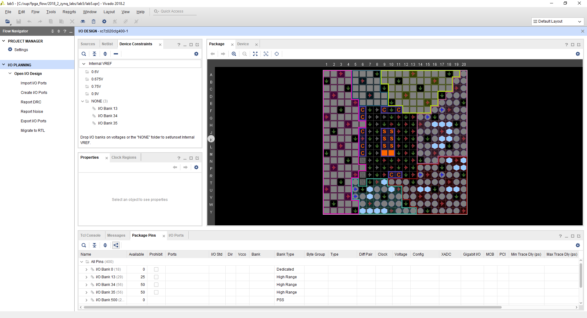
   

   

   <i>I/O Planning project’s default windows and views</i>
   

### Create I/O Ports, Assign Various Pins and Add Source Files

#### Create input ports clk\_pin, btn\_pin and rst\_pin.

1. Select **Flow Navigator > I/O PLANNING > Open I/O Design > Create I/O Parts**.

   The Create I/O Ports form will be displayed.

2. Type **clk\_pin** in the *Name* field, select **Input** for the *Direction* and select **LVCMOS33** as the *I/O Standard*, and click **OK**.

   

   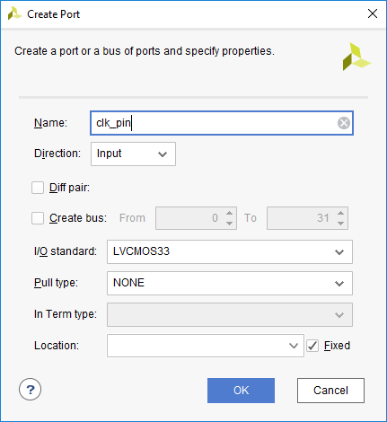
   

   

   <i>Creating I/O Port for clk_pin input</i>
   

3. Similarly, create the **btn\_pin** and **rst\_pin** input ports.

#### Assign input pins clk\_pin, btn\_pin and rst\_pin to H16, D19 and D20 locations using the Device view and package pins. 

Hover the mouse over **H16** in the Device view window.

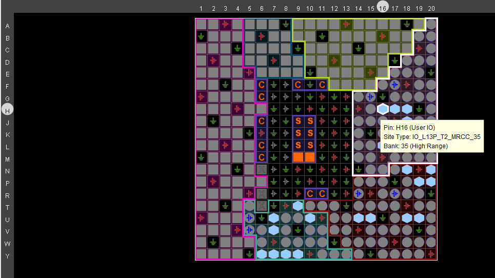

<i>Locating H16 pin in the Device view</i>

1. When located, click on it.

   The pin entry will be highlighted and displayed in the Package Pins tab.

2. In the *Package Pins* pane, click in the *Ports* column of **H16** pin’s row, and select **clk\_pin**.

3. Similarly, add the **btn\_pin** input port at **D19**.

4. Select **Edit > Find** or Ctrl-F to open the Find form.  Select **Package Pins** in the *Find* drop-down field, type **D20** in the match criteria field, and click on **OK**.

   

   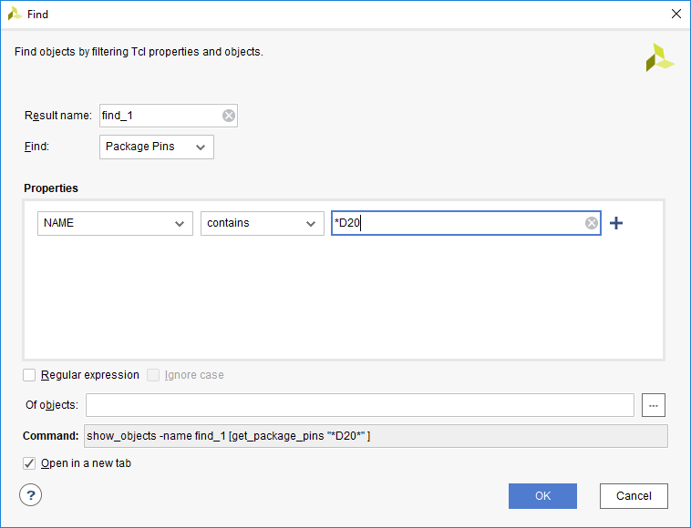
   

   

   <i>Finding a package pin</i>
   

   Notice that the Find Results tab is opened, and the corresponding entry is shown in the tab.

5. Assign the **rst\_pin** input to the pin.

#### Assign output pins led\_pins[0] to led\_pins[7] to locations R14, P14, N16, M14, W14, Y14, T11, T10. Create them as a vector and assign them using the Tcl command *set\_property*. They all will be LVCMOS33.    

**Note:** Notice that PYNQ has four LEDs hence we assign led\_pins[3:0] to LEDs and led\_pins[7:4] are assigned to PMODB.

1. In the I/O Ports tab, click on the create I/O port button on the left vertical ribbon.

   

   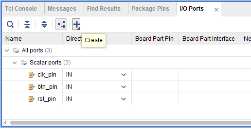
   

   

   <i>Create I/O Ports button</i>
   

   The Create I/O Ports form will be displayed.

2. Type **led\_pins** in the *Name* field, select *Output* direction, click on the check-box of **Create bus**, set the msb to **7**, and select **LVCMOS33** I/O standard and click **OK**. 

   

   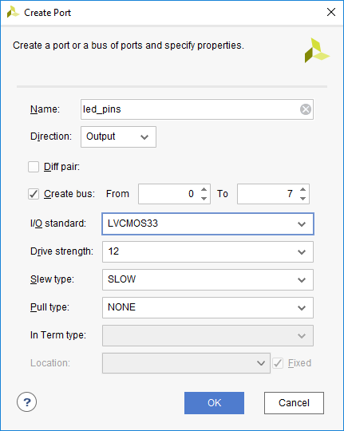
   

   

   <i>Creating I/O ports for the led\_pins output</i>
   

   The led\_pins entries will be created and displayed in the I/O Ports tab.  Notice that the I/O standard and directions are already set, leaving only the pin locations to be assigned.

3. Type the following commands in the console to assign the pin locations.

*set\_property -dict { PACKAGE\_PIN R14   IOSTANDARD LVCMOS33 } [get\_ports { led\_pins[0] }];*

​*set\_property -dict { PACKAGE\_PIN P14   IOSTANDARD LVCMOS33 } [get\_ports { led\_pins[1] }];*

​*set\_property -dict { PACKAGE\_PIN N16   IOSTANDARD LVCMOS33 } [get\_ports { led\_pins[2] }];*

​*set\_property -dict { PACKAGE\_PIN M14   IOSTANDARD LVCMOS33 } [get\_ports { led\_pins[3] }];*

​*set\_property -dict { PACKAGE\_PIN W14   IOSTANDARD LVCMOS33 } [get\_ports { led\_pins[4] }];*

​*set\_property -dict { PACKAGE\_PIN Y14   IOSTANDARD LVCMOS33 } [get\_ports { led\_pins[5] }];*

​*set\_property -dict { PACKAGE\_PIN T11   IOSTANDARD LVCMOS33 } [get\_ports { led\_pins[6] }];*

​*set\_property -dict { PACKAGE\_PIN T10   IOSTANDARD LVCMOS33 } [get\_ports { led\_pins[7] }];*

4.	Select **File > Save Constraints**.

	The Save Constraints form will be displayed.

5. Enter **uart\_led\_pynq** in the *File name* field, and click **OK**.

   

   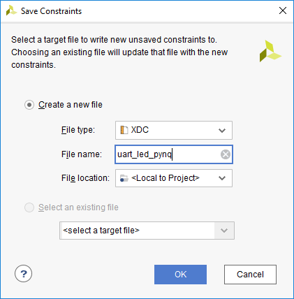
   

   

   <i>Saving constraints</i>
   

   The uart\_led\_pynq.xdc file will be created and added to the Sources tab.

   

   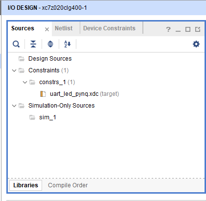
   

   

   <i>The uart_led_pynq.xdc file added to the source tree</i>
   

6. Expand the **Flow Navigator > I/O PLANNING > Open I/O Design > Report DRC**. 

7. Click **OK**.  Notice the design rules checker is run warnings is reported. Ignore the warnings.

8. Expand the **Flow Navigator > I/O PLANNING > Open I/O Design > Report Noise** and click **OK**.  Notice the noise analysis is done on the output pins only (led\_pins) and the results are displayed.

98. Click on **Migrate to RTL**.

   The *Migrate to RTL* form will be displayed with Top RTL file field showing *c:/xup/fpga\_flow/2018\_2\_zynq\_labs/lab5/io\_1.v* entry.

10. Change *io\_1.v* to **uart\_top.v**, and click **OK**

   

   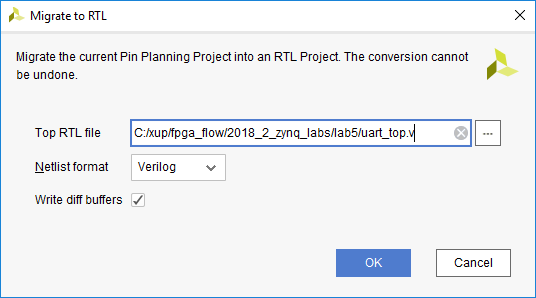
   

   

   <i>Assigning top-level file name</i>
   

11. Select the **Hierarchy** tab and notice that the *uart\_top.v* file has been added to the project with top-level module name as **ios**.  If you double-click the entry, you will see the module name with the ports listing.

    

    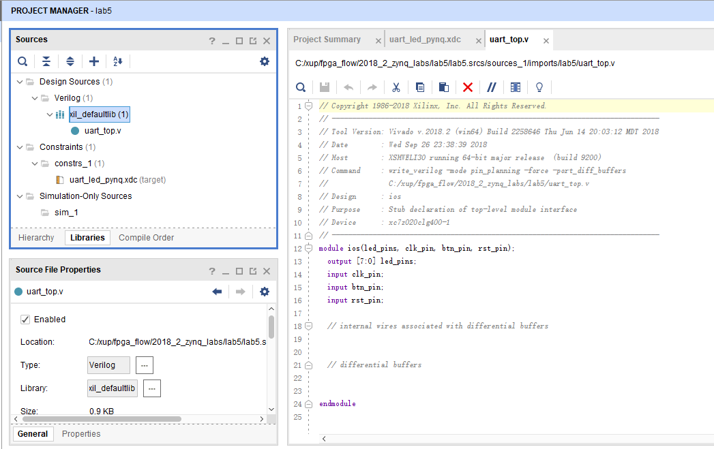
    

    

    <i>The top-level module content and the design hierarchy after migrating to RTL</i>
    

#### Add the provided source files (from <2018\_2\_zynq\_sources>\lab5) to the project.  Copy the uart\_top.txt (located in the <2018\_2\_zynq\_sources >\lab5) content into the top-level source file.

1. Click **Flow Navigator > Add Sources**.

2. In the *Add Sources* form, select *Add or Create Design Sources*, and click **Next**.

3. Click on the **Blue Plus** button, then the **Add Files…**

4. Browse to **<2018\_2\_zynq\_sources>\lab5** and select all .v(led\_ctl.v, meta\_harden.v, uart\_baud\_gen.v, uart\_led.v, uart\_rx.v uart\_rx\_ctl.v) files and click **OK**.

5. Click **Finish**.

6. Using Windows Explorer, browse to **<2018\_2\_zynq\_sources>\lab5** and open uart\_top.txt using any text editor. Copy the content of it and paste it in uart\_top.v (around line 22) in the Vivado project.

7. In the Tcl Shell window enter the following command to change to the lab directory and hit the Enter key.

   *cd C:/xup/fpga\_flow/2018\_2\_zynq\_sources/lab5*

8. Generate the PS design by executing the provided Tcl script.

   *source ps7\_create\_pynq.tcl*

   This script will create a block design called *system*, instantiate ZYNQ PS with one GPIO channel (GPIO14) and one EMIO channel. It will then create a top-level wrapper file called system\_wrapper.v which will instantiate the system.bd (the block design). You can check the contents of the tcl files to confirm the commands that are being run.

9. Double-click on the **uart\_led** entry to view its content.

   Notice in the Verilog code, the BAUD\_RATE and CLOCK\_RATE parameters are defined to be 115200 and 125 MHz respectively.

   

   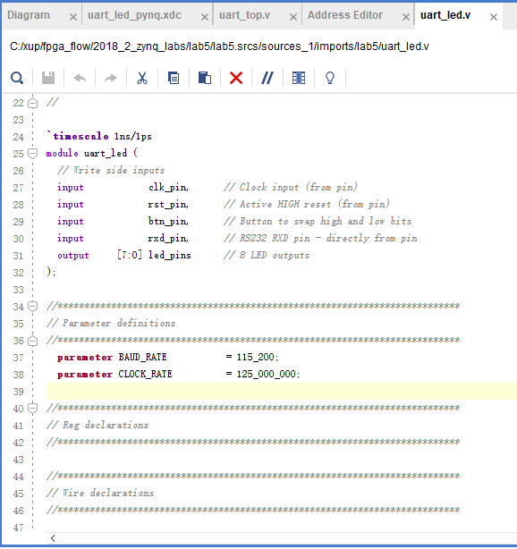
   

   

   <i>CLOCK_RATE parameter of uart_led</i>
   

### Synthesize and Enter Timing Constraints

#### Synthesize the design. Use the Constraints Wizard to specify a clock frequency, and input and output delay constraints.

1. Click on the **Run Synthesis** in the *Flow Navigator* pane.

   Click on the **Save** if Save project window appears.

   When synthesis is completed a form with three options will be displayed.

2. Select *Open Synthesized Design* and click **OK**.

3. In the *Flow Navigator* pane (under Open Synthesized Design), click on the **Constraints Wizard**. This will open up the Constraints Wizard.

4. Read the *Identify and Recommend Missing Timing Constraints* screen of the wizard to understand what the wizard does and click **Next**.

5. Specify the frequency of the object *clk\_pin* to be **125 MHz,** notice the Period, Rise At and Fall At are automatically populated. Also notice the Tcl command that can be previewed at the bottom of the wizard. Click **Next** to proceed.

   

   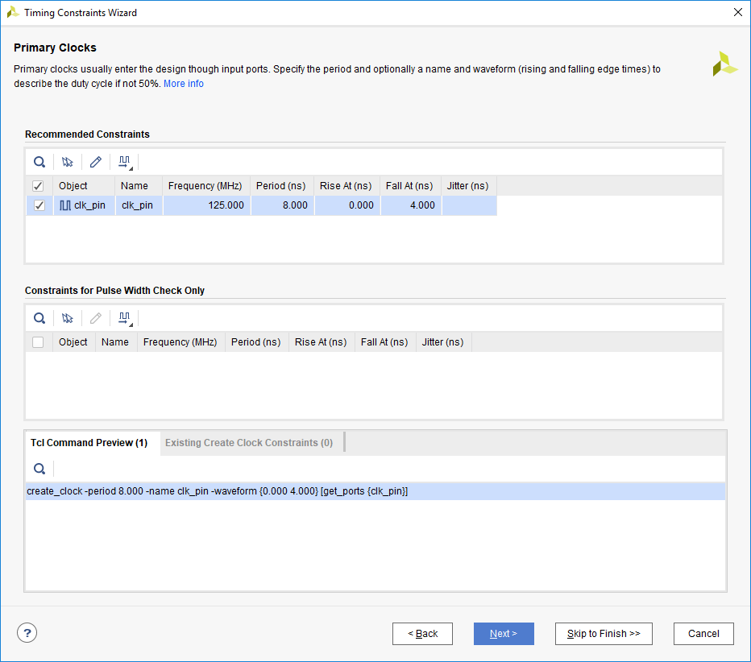
   

   

   <i>Constraints Wizard clk_pin parameters and Tcl command</i>
   

6. There are no missing Generated Clocks, click **Next** to proceed.

7. There are no missing Forwarded Clocks, click **Next** to proceed.

8. There are no missing External Feedback Delays, click **Next** to proceed.

9. The wizard identifies Input Delays needed for the *btn\_pin* and *rst\_pin* pins. Do the following:

   - Press Ctrl and select the two rows.

   - Enter the **tco\_min** value to be **-0.5 ns** and everything else as **0 ns**. Click **Apply**.

   - Notice that under the Tcl Command Preview tab, 4 Tcl commands have been generated.

   - Click **Next**.

   

   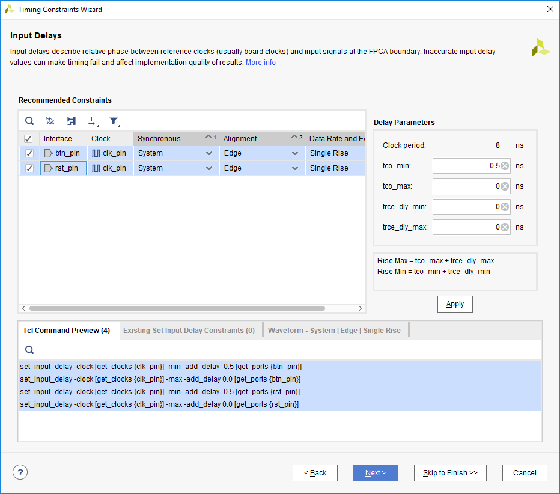
   

   

   <i>Specifying Input Delays for btn_pin and rst_pin</i>
   

10. Enter the tsu and thd as **0 ns** and Enter the trce\_dly\_max and trce\_dly\_min as **-2.20 ns.** Click **Apply** and then click **Next**.

11. There are no Combinatorial Delays identified, click **Next** to proceed.

12. Click **Skip to Finish** to skip to the final Constraints Summary page. Read the description of each page.

13. **Check** *On Finish –* **View Timing Constraints** and click **Finish** to close the wizard. The option will open the Timing Constraints Editor to show you the generated timing constraint.

    

    
    

    

    <i>Selecting View Timing constraints</i>
    

14. Note the wizard generated the clk\_pin constraint for a 8 ns period (or 125 MHz). Notice in the All Constraints window, 7 constraints will be created. 

    There is no need to click Apply since the constraints have already been applied in the Constraints Wizard.

    

    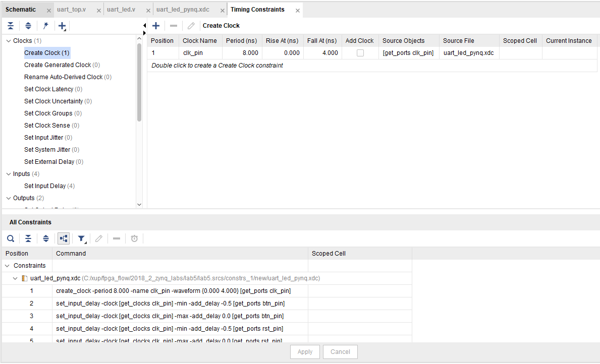
    

    

    <i>The constraints added after using the Constraints Wizard</i>
    

15. Open uart\_led\_pynq.xdc (if it was already opened, click Reload in the yellow status bar) and notice additional constraints were added to the last line of the file. 

#### Generate an estimated Timing Report showing both the setup and hold paths in the design.

1. Select **Flow Navigator > SYNTHESIS > Open Synthesized Design > Report Timing Summary**.

2. In the **Options** tab, select *min\_max* from the *Path delay type* drop-down list.

   

   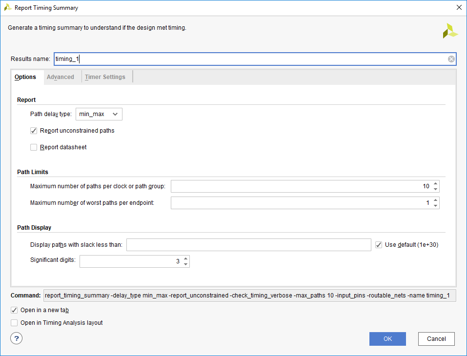
   

   

   <i>Performing timing analysis</i>
   

3. Click **OK** to run the analysis.

   The Timing Results view opens at the bottom of the Vivado IDE.

   

   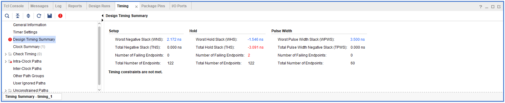
   

   

   <i>Timing summary</i>
   

   The *Design Timing Summary* report provides a brief worst Setup and Hold slack information and Number of failing endpoints to indicate whether the design has met timing or not.

   Note that there are three timing failures under the hold check.

4. Click on the link next to *Worst Hold Slack* (WHS) to see the list of failing paths.

   

   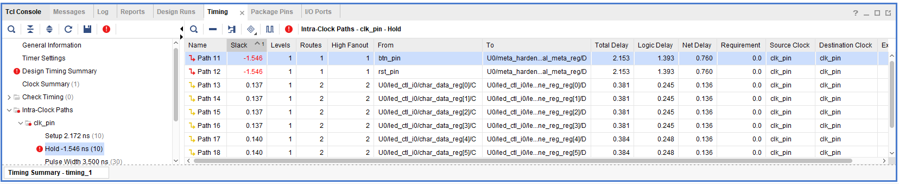
   

   

   <i>The list of paths showing hold violations</i>
   

5. Double-click on the *Path 11* to see the actual path detail.

   

   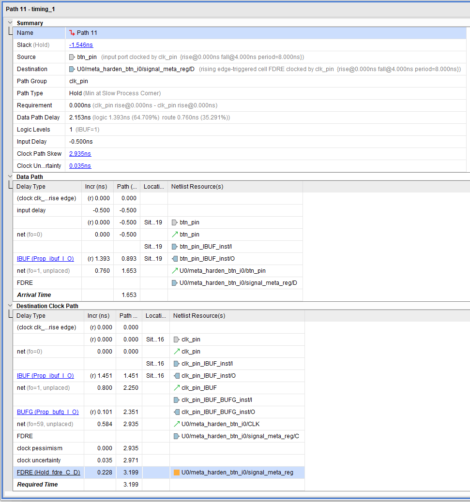
   

   

   <i>Failing hold path</i>
   

6. Select *Path 11*, right-click and select **Schematic**.

   

   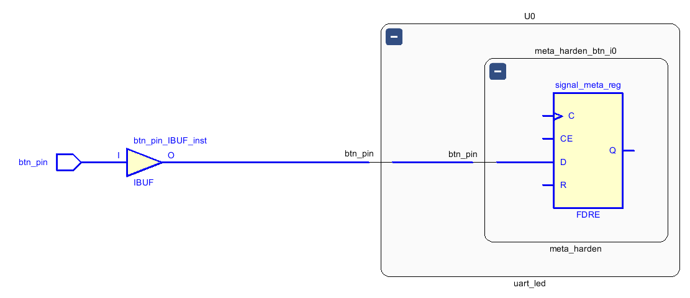
   

   

   <i>The schematic of the failing path</i>
   

### Implement and Analyze Timing Summary

#### Implement the design.

1. Click on the **Run Implementation**.

2. Click **Yes** to run the synthesis first before running the implementation process.

   When the implementation is completed, a dialog box will appear with three options.  

3. Select the *Open Implemented Design* option and click **OK**.

4. Click *Yes* if you are prompted to close the synthesized design.

#### Generate a timing summary report

1. Select **Flow Navigator > IMPLEMENTATION > Open Implemented Design > Report Timing Summary**.

2. Click **OK** to generate the report using the default settings.

   The *Design Timing Summary* window opens at the bottom in the Timing tab.

   Note that failing timing paths are indicated in red. 

   

   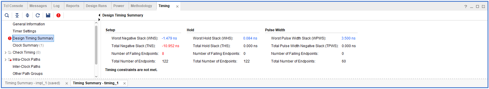
   

   

   <i>Failing setup paths</i>
   

3. Click on the *WNS* to see the failing paths.

4. Double-click on the first failing path from the top and see the detailed analysis.  

   The output path delay can be reduced by placing the register in IOB.

5. Apply the constraint by typing the following two commands in the Tcl console.

   set\_output\_delay -clock [get\_clocks clk\_pin] -min -add\_delay -2.250 [get\_ports {led\_pins[*]}]

   set\_output\_delay -clock [get\_clocks clk\_pin] -max -add\_delay -2.250 [get\_ports {led\_pins[*]}] 

6. Select **File > Constraints > Save**. Click **OK** at the warning message. Click **Yes** to save the project.

7. Click on **Run Implementation**.

8. Click **Yes** to reset the synthesis run, perform the synthesis, and run implementation.

9. Open the implemented design and observe that the number of failing paths in the Design Runs tab reported is 0.

10. Click Report Timing Summary, and observe that there are no failing paths.

### Generate the Bitstream and Verify the Functionality (Optional) 

#### Generate the bitstream.    

1. Click **low Navigator > PROGRAM AND DEBUG > Generate Bitstream**.

2. The write\_bitstream command will be executed (you can verify it by looking in the Tcl console).

3. Click **Cancel** when the bitstream generation is completed.

#### Connect the board and power it ON. Open a hardware session, and program the FPGA.  

1. Make sure that the Micro-USB cable is connected to the JTAG PROG connector.

2. Turn ON the power.

3. Select the *Open Hardware Manager* option.

   The Hardware Manager window will open indicating “unconnected” status.

4. Click on the **Open target** link, then **Auto Connect** from the dropdown menu.

   You can also click on the **Open recent target** link if the board was already targeted before.

5. The Hardware Manager status changes from Unconnected to the server name and the device is highlighted. Also notice that the Status indicates that it is not programmed.

6. Select the device and verify that the **ios.bit** is selected as the programming file in the General tab.

#### Start a terminal emulator program such as TeraTerm or HyperTerminal. Select an appropriate COM port (you can find the correct COM number using the Control Panel).  Set the COM port for 115200 baud rate communication. Program the FPGA and verify the functionality. 

1. Start a terminal emulator program such as TeraTerm or HyperTerminal. 

2. Select an appropriate COM port (you can find the correct COM number using the Control Panel).  

3. Set the COM port for 115200 baud rate communication. 

4. Right-click on the FPGA entry in the Hardware window and select Programming Device…

5. Click on the **Program** button.

   The programming bit file be downloaded and the DONE light will be turned ON indicating the FPGA has been programmed.

### Start a SDK session, point it to the c:/xup/fpga\_flow/2018\_2\_zynq\_sources/lab5/pynq/lab5.sdk workspace. 

1. Open **SDK** by selecting **Start > Xilinx Design Tools > Xilinx SDK 2018.2**

2. In the **Select a workspace** window, click on the browse button, browse to *c:/xup/fpga\_flow/2018\_2\_zynq\_sources/lab5/pynq/lab5.sdk* and click **OK**.

3. Click **OK**.

   In the *Project Explorer*, right-click on the uart\_led\_zynq, select *Run As*, and then **Launch on Hardware (System Debugger)**

4. Verify the functionality as you did in the previous lab, by typing some characters into the terminal, and watching the corresponding values appear on the LEDs.

5. When satisfied, close the terminal emulator program and power OFF the board.

6. Select **File > Close Hardware Manager**. Click **OK** to close it.

7. When done, close the **Vivado** program by selecting **File > Exit** and click **OK**.

8. Close the **SDK** program by selecting **File > Exit** and click **OK**.

## Conclusion 

In this lab, you learned how to create an I/O Planning project and assign the pins via the Device view, Package Pins tab, and the Tcl commands. You then exported to the rtl project where you added the provided source files. Next you created timing constraints and performed post-synthesis and post-implementation timing analysis. 
